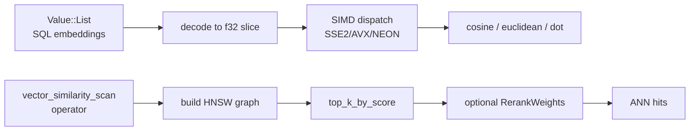

# Vector (akar-vector)

**Module path:** `akar-core/akar-vector/`
**Role:** Core domain — embedding math, HNSW ANN index, SQL vector functions.

---

## Overview

`akar-vector` is the embedding side of the engine: SIMD-accelerated distance kernels (dot, Euclidean/L2, L1, cosine), an in-process HNSW approximate nearest-neighbor (ANN) index, and a `VECTOR` SQL extension that exposes scalar functions plus the `vector_similarity_scan` table function. Its role in the architecture is to make "semantic retrieval" work inside Cypher without shipping users off to an external vector database. A score has no identity without a ranking method and no persistence without an index — this crate supplies all three.

A notable architectural point sits at its core: the kernels deal in compact, contiguous `f32` slices (decoded from `Value::List<f64/f32>`), and dispatch to SIMD at runtime using `is_x86_feature_detected!` — one portable binary, not per-CPU builds.

## Core functions

1. **Distance kernels** — `cosine_similarity` (`distance.rs:403`), `cosine_distance` (`:414`), `dot_product` (`:420`), `euclidean_distance` (`:426`), `l2_squared` (`:348`) — all runtime-dispatched.
2. **Fused kernel** — `dot_and_sq_norms` (`distance.rs:323`) computes dot and squared norms in one vectorized pass (so cosine works without a separate normalization pass); `l1_distance` (`:373`).
3. **Batch kernels** — `batch_cosine_similarities` (`distance.rs:457`) and `batch_dot_and_sq_norms` (`:444`) for cache-friendly row sweeps.
4. **Selection** — `top_k_by_score` (`distance.rs:482`) is a bounded partial-sort helper used by ANN/rerank paths.
5. **SQL extension** — `VectorExtension` (`lib.rs:29`, name `VECTOR` at `:45`) registers the scalar functions and the `vector_similarity_scan` table function via `Extension::load`.
6. **Rerank tuning** — `RerankWeights` (`lib.rs:182`) controls post-ANN reranking of hits.

## Key components

| Component/type | File path | One-line responsibility |
|---|---|---|
| `VectorExtension` | `akar-vector/src/lib.rs:29` | SQL side: scalar fns + `vector_similarity_scan` |
| Distance kernels | `akar-vector/src/distance.rs:32,46,52` | Scalar fallbacks; SIMD dispatch at `:323,:348,:403` |
| SIMD gates | `akar-vector/src/distance.rs:18,21` | `MIN_DIM_SIMD=16`, `MIN_DIM_AVX=32` |
| `RerankWeights` | `akar-vector/src/lib.rs:182` | Post-ANN rerank control |
| HNSW index | `akar-vector/src/hnsw.rs` | In-process ANN (built/persisted per `TableCatalog` refresh) |

## Internal data flow

Embeddings arrive as SQL arrays, are decoded into contiguous `f32` slices, and flow through the SIMD-gated kernels. On the ANN side, `vector_similarity_scan` builds (or uses) the HNSW graph, `top_k_by_score` returns the nearest neighbors, and optional `RerankWeights` re-scores them for precision/recall tuning.

## Key interfaces & extension points

- **`Extension` trait** — `VectorExtension::load(&ExtensionContext)` is the registration point for scalar functions + the table function (hub of the extension framework).
- **Distance kernels** are the shared primitives for both SQL scalar calls and HNSW (crate-internal reuse).
- **`RerankWeights`** is the precision/recall tuning dial of the ANN read path.

## Interactions with other modules

| Module | Direction | Interface used |
|---|---|---|
| akar-extension | → | `VectorExtension` implements the `Extension` contract |
| akar-processor | consumes ← | Executes the `[VectorSimilarityScan(HNSW)]` read path (registered table fn) |
| akar-main (catalog) | consumes ← | `TableCatalog::refresh_vector_indexes_for_tables` maintains HNSW graphs on DML |
| akar-search | → | Consumes vector scores as the fusion "vector" channel |

## Performance & concurrency notes

SIMD kicks in from 16 dims (SSE2) and AVX from 32 dims — below threshold, scalar fallbacks run. `batch_*` kernels enable cache-friendly full-table sweeps; `top_k_by_score` uses bounded partial selection rather than a full sort. HNSW reads are driven from SQL on demand; build/refresh is owned by the catalog (`refresh_vector_indexes_for_tables`), not per-query.

## Implementation highlights

- **Runtime feature detection** (`is_x86_feature_detected!`) keeps a single portable binary while still getting SIMD where available.
- **Fused dot+norms** means cosine costs one vectorized pass, not a separate normalization step.
- **ANN read path is fully SQL-visible** (P71.1–P71.4) — `vector_similarity_scan` and the optimizer's `VectorSimilarityDetection` replaced the earlier write-only vector-index behavior; vector search is now a plain Cypher query.