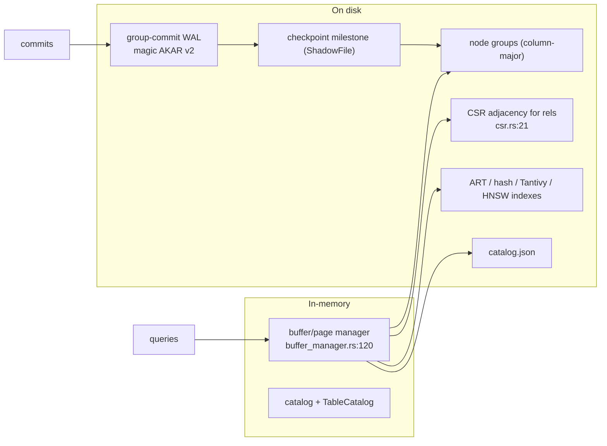

# 6. Akar — Database Overview

> Akar *is* a database engine, not a consumer of one — so this document describes the on-disk world it creates and protects: the WAL, the catalog, the columnar format, the indexes, checkpointing, and the compatibility gates.

## The database as a directory

Akar stores an entire database in one directory passed to `Database::new(path)`. Inside it: per-table data files laid out columnar, a system catalog persisted as `catalog.json` (`CATALOG_FILE_NAME`, `akar-main/src/database.rs:23`), the write-ahead log, and checkpoint milestone state prepared via a shadow file. The format is versioned at two levels:

| Contract | Value | Location |
|---|---|---|
| `STORAGE_VERSION` | `1` | `akar-storage/src/version_info.rs` |
| WAL magic / format | `b"AKAR"`, version `2` | `akar-storage/src/wal.rs:12,14` |
| Catalog file | `catalog.json` | `akar-main/src/database.rs:23` |

Version mismatches are hard errors on open — never silent corruption — and `STORAGE_VERSION` bumps without a migration are gated to SemVer `0.2.0`.

## Storage architecture

**Column-major node groups** (`node_group.rs:129`, `table.rs:1230`): nodes are stored in columnar groups — a column is one contiguous Arrow-style array per group, giving cache-locality for vectorized scans and analytics. **CSR adjacency** (`csr.rs:21`) holds relationship endpoints as offset + adjacency arrays, the layout chosen for fast multi-hop graph traversal. Buffers are managed by the `buffer_manager` with page eviction and a memory pool; when the pool watermark is hit, operators can spill (P110/P111).

## The write path & durability

- **Group-commit WAL** (`wal.rs`): all committed transactions in the same epoch append their records in one group flush, then the commit acknowledges — durability-on-commit without a per-statement fsync stall.
- **Crash recovery** (`wal_replayer.rs:36`): on open, the WAL is replayed from the last checkpoint milestone, re-materializing every committed row before the milestone. `--skip-wal` (salvage mode, P114.2) can bypass replay for rescue operations.
- **Checkpoint** (ShadowFile in `wal.rs:324` region): the whole table set is re-flushed into a shadow file then atomically promoted, truncating the WAL. The threshold is configurable (`--checkpoint-threshold`, default 16 MiB); the historical per-write checkpoint caused ~1 s `persist_all_tables` rewrites, so the threshold default deliberately amortizes them.

## Transactions & concurrency

Reads run against **MVCC snapshots** — a query sees a consistent cut of the graph. Writes run optimistic-concurrency: each writer tracks its row-level write-set (`written_rows`), and at commit the transaction layer validates against the commit history; a rival writer that touched the same rows gets a `WriteConflict` error and may retry — not corruption, not blocking. The catalog is guarded by `Arc<Mutex<TableCatalog>>`, serializing schema mutation while data reads proceed on snapshots.

## Indexes

| Index | Backing | Use |
|---|---|---|
| Primary key | ART (adaptive radix tree), `art_index.rs` | O(k)-ish point/range PK lookups; `ArtRangeScanDetection` rewrites range predicates into ART scans |
| Secondary | Hash index | Equality lookups |
| Full-text | Tantivy (BM25), `akar-fts` | Per-text-column inverted index; incremental catch-up on DML (P105.3/P107.1); `WITH TOKENIZER(...)` DDL (P109.1) |
| Vector ANN | HNSW, `akar-vector/src/hnsw.rs` | Approximate nearest neighbors, maintained by `TableCatalog::refresh_vector_indexes_for_tables` on DML and read from SQL (`vector_similarity_scan`) |

Index freshness is a per-family concern: FTS keeps an incremental Tantivy writer, HNSW graphs are refreshed by the catalog on DML, and ART/hash live inside the storage engine's own transactionally-visible structures.

## Data inflow (COPY & readers)

`COPY FROM` feeds the store from CSV, Parquet, JSON, and NPY through the contained readers (`akar-storage` readers; `PhysicalCopyFrom` at `akar-processor/src/physical/write_ops/copyfrom.rs:17`). Foreign engines connect at the query layer instead of importing data: DuckDB / SQLite / Postgres interop functions and the lakehouse adapters (Delta, Iceberg, Azure Blob, Unity Catalog) either read native pure-Rust or delegate to DuckDB (see [Integrations](./4.Deep-Exploration/integrations.md)). Such reads are transient — no on-disk format change.

## Backup & export

- `EXPORT DATABASE '<path>'` produces a portable copy (wired as the server's `export` op).
- `COPY TO` writes results to file.
- On close, in-process reentrant file locks permit `close → reopen` cycles even while wrappers still reference objects (P53.18/P53.35).

## Cross-cutting guarantees

- **Single-writer**: one process holds the database file lock; the (deprecated) TCP daemon exported that single writer to many sessions over the wire.
- **No server**: the embedded engine's durability decisions all assume one process. Multi-process access is the server crate's (legacy) concern.
- **Recovery truthfulness**: WAL replay is the source of truth after crash; the milestone makes replay bounded.