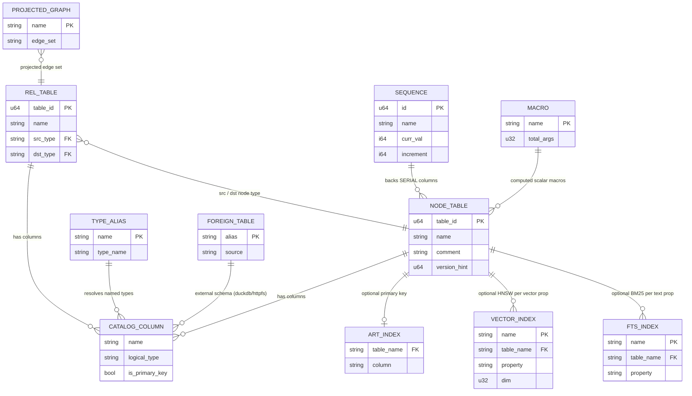

# Database Overview

**Note on trigger conditions**: This project has **no external/associated database in the usual sense** — there are no `.sql` schema files, no migrations directory, no ORM (diesel/sqlx/prisma/…) in the dependency graph, and no `database.yml`. The relaxed trigger rules do not fire for a *consuming* database. However, Akar **is itself a database engine**, so documenting *its* on-disk schema is both applicable and useful: this overview describes the native storage layout, the metadata catalog entities, and the durability artifacts a maintainer or embedder will encounter inside a database directory. Think of it as "the schema Akar writes when *you* use it," rather than "the schema a separate DB writes for Akar."

---

## Statistical summary

The counts below describe the persistent *physical* layout — file families and catalog object kinds — rather than user-defined tables (any number of those can exist at runtime).

| Category | Count | Notes |
|----------|-------|-------|
| Core table-file families | 4 | Column chunks (`.col`), node groups, CSR adjacency (fwd/rev), overflow (`.ovf`) |
| Durability artifacts | 3 | WAL file, checkpoint mirrors, lock file |
| Catalog object kinds (`CatalogEntry` variants) | 9 | Node/rel table, sequence, vector index, FTS index, foreign table, macro, type alias, projected graph |
| Secondary index types | 3 | ART primary-key, HNSW vector, Tantivy FTS (on-disk under `fts/`) |
| WAL DDL record variants | 6 | Typed replay covers the DDL subset needed for recovery |

These numbers are read off the code (`CatalogEntry` enum and `StorageManager` layout), not estimated: every catalog variant in `akar-catalog/src/lib.rs:308-315` corresponds to a persisted entity, and the durability artifacts are named by constants in `akar-main/src/database.rs` (`CATALOG_FILE_NAME` `:23`, `LOCK_FILE_NAME` `:30`).

---

## On-disk layout (database directory)

A database directory opened via `Database::new(path, ...)` contains the following cooperating artifacts. The design intent behind the split: *mirrors are fast to load, the WAL is cheap to append, and recovery = mirrors + replay*.

| Artifact | Produced by | Role |
|----------|-------------|------|
| Catalog file (`CATALOG_FILE_NAME`, `akar-main/src/database.rs:23`) | `Catalog::save_to_path` (`akar-catalog/src/lib.rs:1370`) | JSON-serialized schema system of record — tables, sequences, indexes, macros, aliases, foreign tables, projected graphs |
| Lock file (`LOCK_FILE_NAME`, `database.rs:30`) | `Database::new` | Single-writer process guard — prevents two processes opening the same directory for write |
| WAL (append-only) | `StorageManager::commit_transaction` (`akar-storage/src/lib.rs:658`) | Durable log of committed deltas + DDL; fsync'd before ack; truncated at checkpoint |
| Checkpoint mirrors | `checkpoint` (`lib.rs:488`) | Rewritten column state at last checkpoint — recovery loads these first, then replays WAL on top |
| Column chunks / node groups | `StorageManager` page layer | The actual column-major table data, page-managed via `PageManager`/FSM |
| CSR adjacency (forward/reverse) | `RelTable` (`akar-storage/src/table.rs`) | Graph traversal substrate maintained alongside columns |
| Overflow pages (`.ovf`) | page manager | Values too large for inline pages |
| ART index files | `art_index.rs` | Primary-key index (Node4/16/48/256) |
| Vector index files | `vector_index.rs` (`restore_vector_index` `lib.rs:407`) | HNSW graph persisted/restored with tables |
| `fts/<name>/` directories | Tantivy via `akar-fts` | Full-text segments — crash boundary = Tantivy segment commit (P107.3) |

**Recovery contract** (why this layout works): `StorageManager::recover` (`lib.rs:844`) loads checkpoint mirrors first, then replays typed WAL deltas (`replay_data_record` `lib.rs:921`) with last-write-wins on duplicate PKs (P2-WAL-1) — so a crash at any point converges to the last committed state, bounded by `checkpoint_threshold` (16 MiB default) worth of replay.

---

## Entity relationship diagram (catalog)

The catalog is the metadata heart of the database. This ER diagram shows how the nine `CatalogEntry` kinds relate to tables and to one another — the structure a `SHOW TABLES`-style introspection (via `connection_info`, `akar-catalog/src/lib.rs:1267`) exposes conceptually.

---

## Core catalog entities (field detail)

The tables below drill into the two entities every maintainer touches most — node tables (the canonical property container) and sequences (the id-allocation machinery) — followed by index registration. Field lists are read from the struct definitions, not inferred.

### NodeTableEntry (`akar-catalog/src/lib.rs:47`)

| Field | Type | Constraint | Meaning |
|-------|------|------------|---------|
| `table_id` | `u64` | PK (catalog-internal) | Stable id surviving renames — WAL/plan references use ids, not names |
| `name` | `String` | unique | User-visible, case-sensitive label the binder resolves against |
| `columns` | `Vec<CatalogColumn>` | ≥1 | Column-major schema: each has `name` + `LogicalTypeID` |
| primary key | optional column (`primary_key_column` `:59`) | at most one | Backs ART lookup (`has_art_index` `:68`) and `PhysicalPrimaryKeyScan` |
| `comment` | optional `String` | — | `COMMENT ON` storage (`set_table_comment` `:937`) |

### SequenceEntry (`akar-catalog/src/lib.rs:99`)

| Field | Type | Constraint | Meaning |
|-------|------|------------|---------|
| `name` | `String` | PK | Sequence name; SERIAL columns get generated names (`get_serial_name` `:180`) |
| `curr_val` | `i64` | monotonic | Current allocation cursor (`curr_val` `:135`) |
| `increment` | `i64` | ≠0 | Step size — negative sequences supported |
| allocation unit | via `next_k_val` (`:140`) | batch | Gap-free batches amortize catalog updates; `rollback_val` (`:155`) returns unused ids on abort |

### Index registrations

| Index | Entry struct | Backs | On-disk form |
|-------|--------------|-------|--------------|
| ART primary key | (`has_art_index` on table, `lib.rs:68`) | point lookup / uniqueness | `art_index.rs` trie (Node4/16/48/256) |
| HNSW vector | `VectorIndexEntry` (`lib.rs:187`) | `cosine_similarity` ANN | `vector_index.rs` graph (`create_vector_index` `:451`) |
| Tantivy FTS | `FtsIndexEntry` (`lib.rs:202`) | `USING FTS INDEX`, BM25 | `fts/<name>/` segments (`register_fts_index` `:485`) |

---

## Views, stored procedures, functions

Akar has no SQL `VIEW`/stored-procedure objects in the RDBMS sense; the equivalent surfaces are:

- **Scalar/aggregate functions** — 260 builtins in `FunctionRegistry` (`akar-function/src/registry/`), including name-mangled distinct aggregates (e.g. `count_distinct`, P88), listed via `show_functions()`.
- **Table functions** — `CALL`-able: 18 GDS algorithms (`akar-algo/src/lib.rs`), `vector_similarity_scan`, system introspection functions — dispatched via `standalone_call.rs`.
- **Macros (closest to views)** — `ScalarMacroEntry` (`akar-catalog/src/lib.rs:235`) provides named, parameterized scalar expressions persisted in the catalog (`create_macro` `:824`) — a lightweight, reified "view over an expression."
- **Projected graphs** — `ProjectedGraphInfo` (`lib.rs:298`) persists a named projected edge set over rel tables — arguably the closest object to a *graph view* (named, cataloged, reusable).

---

## Durability & consistency quick reference

| Guarantee | Mechanism | Code anchor |
|-----------|-----------|-------------|
| Atomic commit | WAL fsync before MVCC publish | `commit_transaction` (`akar-storage/src/lib.rs:658`) |
| Crash recovery | mirrors → typed WAL replay (LWW) | `recover` (`lib.rs:844`), `replay_data_record` (`:921`) |
| Bounded recovery time | checkpoint at 16 MiB WAL | `maybe_checkpoint` (`lib.rs:506`) |
| Write-write isolation | row-level OCC validation | `validate_write_set` (`akar-transaction/src/lib.rs:511`) |
| Index/row consistency | commit-gated FTS sync + HNSW refresh | `sync_indexes_on_commit` (`fts_sync.rs:39`) |
| Salvage (corrupt WAL) | explicit opt-in `set_skip_wal` | `lib.rs:211` |
| Single-writer guard | lock file at open | `LOCK_FILE_NAME` (`database.rs:30`) |

---

*Generated: 2026-09-23 · Sources: `akar-core/akar-catalog/src/lib.rs`, `akar-core/akar-storage/src/lib.rs`, `akar-core/akar-main/src/database.rs`, `akar-core/akar-transaction/src/lib.rs`, `.terrain/.litho-agent/database.md`*
