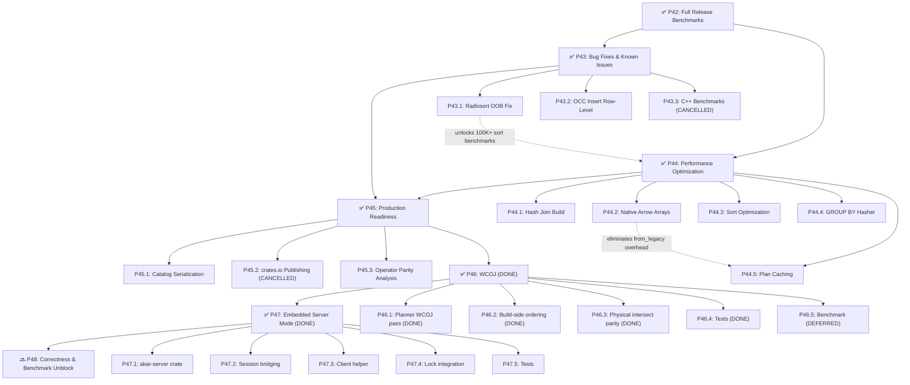

# Implemented Context - Arsip Detail yang Sudah Dikerjakan

> **Arsip:** 2026-08-02. Detail historis (task tables, audit findings, commit history, keputusan desain) yang sudah diimplementasikan, dipindahkan dari `akar-core/STATUS.md` dan `akar-core/implementation_plan.md` agar kedua dokumen tersebut ringkas. STATUS.md sudah dihapus; status & rencana terkini lihat [`SPEC.md`](../../SPEC.md) dan [`implementation_plan.md`](../../implementation_plan.md).

---

## Bagian 1: STATUS.md - Complete Phases (P1-P44)

## 2. Complete Phases — All Done (P1-P44)

### ✅ P0: Fix Regression (Pre-Sprint)
- Fixed `test_sip_optimization` regression
- Verified `cargo test --workspace` → 955 passed, 0 failed

### ✅ P10: Core Pipeline (23 SP)
- COPY TO, TRANSACTION, EXTENSION, nullif/count_if, physical_operator.rs refactor

### ✅ P11: Functions & Multi-DB (13 SP)
- size(), export_csv/parquet, ATTACH/DETACH/USE DATABASE, LOAD FROM

### ✅ P12: Physical Operators (13 SP)
- TOP_K, INDEX_LOOKUP, BATCH_INSERT, lambda list, path/pattern

### ✅ P13: Extensions & Graph Management (13 SP)
- CREATE TYPE, COMMENT ON, CREATE/USE/DROP GRAPH, GDS_CALL wiring, error(), STANDALONE_CALL

### ✅ P14: Storage Extensions (8 SP)
- Parquet writer, NPY reader, HyperLogLog, RoaringBitmap, compression

### ✅ P15: Types & Missing Operators (8 SP)
- JSON, UINT128, DTime, Value::Union + 11 missing physical operators

### ✅ P16-P25: Operator Implementations & Modularization
- Real physical operator implementations, missing ops, modularization (6 phases), technical debt closure

### ✅ P26: Testing, Fuzzing & Profiling (17 SP)

| Sub-phase | Content | Status |
|-----------|---------|--------|
| P26.1 | Edge Case Test Suite — 7 test files, 137+ tests | ✅ |
| P26.2 | Fuzz Testing — 3 cargo-fuzz targets | ✅ |
| P26.3 | Property-Based Testing — 3 proptest properties | ✅ |
| P26.4 | Performance Profiling — 8 benchmark suites, full report | ✅ |

### ✅ P27: Performance Optimization (14 SP)

| Sub-phase | Content | Status |
|-----------|---------|--------|
| P27a | SipHash → ahash for aggregate hash table | ✅ |
| P27b | Pre-size HashMap (3 locations) | ✅ |
| P27c | Multi-key GROUP BY — Vec\<Value> alloc eliminated | ✅ (P30.2) |
| P27d | K-way merge — O(k) → O(log k) | ✅ (P30.2) |
| P27e | SIMD Aggregate via Arrow Compute | ✅ |
| P27f | `#[inline(always)]` on hot paths | ✅ (P30.2) |
| P27g | Column Mapping SQL Aggregate — 6 tests un-ignored | ✅ |
| P27.5 | Direct ColumnChunk→Arrow Scan Path — ScanNode **7.8× faster** | ✅ |
| P27.6 | Aggregate COUNT Fast Path — Aggregate **7× faster** | ✅ |

**🏆 C++ Parity achieved:** Rust 397 µs ≈ Vela 400 µs ≈ Ladybug 374 µs

### ✅ P28: Migration & CLI (12 SP)

| Sub-phase | Content | Status |
|-----------|---------|--------|
| P28.1 | C++ Storage Migration Tool (Read-Only) | ✅ |
| P28.3 | CLI Feature Parity (Box output mode) | ✅ |

### ✅ P29: Feature & Function Completeness (6 SP)
- 18 missing functions: sinh, cosh, tanh, gcd, lcm, soundex, base64, etc.

### ✅ P30: Stabilisasi & Benchmark Komprehensif (18 SP)

| Sub-phase | Content | Status |
|-----------|---------|--------|
| P30.1 | Fix 56 Ignored Tests — all fixed (31 in final session) | ✅ |
| P30.2 | Optimasi Query Kompleks (P27c, P27d, P27f deferred items) | ✅ |
| P30.3 | LadybugDB Benchmark Suite — 3-way parity verified | ✅ |
| P30.4 | STANDALONE_CALL Refactor — trait-based dispatch | ✅ |
| P30.5 | WASM + Fuzz CI | ✅ |
| P30.6 | GitHub Releases + binary distribution | ✅ |

### ✅ P31: Final Parity Sprint (4 SP)

| Sub-phase | Content | Status |
|-----------|---------|--------|
| P31.1 | Register Lambda Functions + 7 Missing Aliases | ✅ |
| P31.2 | Implement GREATEST / LEAST | ✅ |
| P31.3 | CALL Handlers: Projected Graph Management | ✅ |
| P31.4 | Fix akar-migrate Parquet Footer | ✅ |

### ✅ P32: Polish & DX (2 SP)

| Sub-phase | Content | Status |
|-----------|---------|--------|
| P32.1 | Clippy 29→0 Warnings | ✅ |
| P32.2 | export_csv / export_parquet CALL Handlers | ✅ |
| P32.3 | Error Messages Improved | ✅ |

### ✅ P33: Deferred Nice-to-Have Items (5 SP)

| Item | Detail | Status |
|------|--------|--------|
| StorageDriver API | `StorageDriver` struct wrapping `Arc<StorageManager>` | ✅ |
| gzip VFS | `GzipFileSystem` implementing `FileSystem` trait | ✅ |
| Progress bar | `AkarProgress` wrapper around `indicatif::ProgressBar` | ✅ |
| WAL dump tool | `wal_dump` binary + `Display` impl for `WALRecord` | ✅ |
| Shell HTML/LaTeX | `.mode html` and `.mode latex` output modes | ✅ |

### ✅ P34: Extension Depth — Native Readers (13 SP)

| Sub-phase | Content | Status |
|-----------|---------|--------|
| P34.1 | akar-azure: Native Azure Blob Storage Reader | ✅ |
| P34.2 | akar-iceberg: Native Iceberg Reader | ✅ |
| P34.3 | akar-delta: Native Delta Lake Reader | ✅ |
| P34.4 | akar-unity-catalog: Native Unity Catalog Client | ✅ |

### ✅ P35: Remaining Minor Gaps (1 SP)

| Sub-phase | Content | Status |
|-----------|---------|--------|
| P35.1 | ConstantOrNullFunction | ✅ |
| P35.2 | ConfidentialStatementAnalyzer | ✅ |

### ✅ P36: Critical Pipeline Gaps (29 SP)

#### ✅ P36.1 — CSR Adjacency Implementation (5 SP)

| Task | Description | Files |
|------|-------------|-------|
| P36.1a | Define CSR data structures: `fwd_offsets`, `fwd_adjacency`, `rev_offsets`, `rev_adjacency` | `akar-storage/src/csr.rs` |
| P36.1b | Implement `build()` from flat `Vec<RelData>` | `akar-storage/src/csr.rs` |
| P36.1c | Implement `get_neighbors(node_id, direction) -> &[NodeID]` using binary search on offsets | `akar-storage/src/csr.rs` |
| P36.1d | Add `num_nodes()`, `num_edges()`, `is_empty()` methods | `akar-storage/src/csr.rs` |
| P36.1e | Add 7 tests: build, get_neighbors, empty, single/multi edge | `akar-storage/src/csr.rs` |

**Result:** CSR fully implemented with forward + reverse adjacency. 7 unit tests. All 696 storage tests pass.

#### ✅ P36.2 — AST ORDER BY/LIMIT/SKIP Fields (2 SP)

| Task | Description | Files |
|------|-------------|-------|
| P36.2a | Add `OrderByItem { expression, ascending }`, `order_by`, `limit`, `skip` to `ReturnClause` | `akar-parser/src/ast.rs` |
| P36.2b | Update parser: `parse_order_by()`, `parse_limit_skip()` helpers | `akar-parser/src/parser/dml.rs` |
| P36.2c | Update `BoundReturnClause` with `BoundOrderByItem` + new fields | `akar-binder/src/bound_statement.rs` |
| P36.2d | Update `bind_return()` in both `binder/dml.rs` and `binder/mod.rs` | `akar-binder/src/binder/` |
| P36.2e | Update parameter substitution for new fields | `akar-main/src/prepared_statement.rs`, `substitute.rs` |

**Result:** `RETURN x ORDER BY y DESC LIMIT 10 SKIP 5` parses and binds correctly through entire pipeline.

#### ✅ P36.3 — DDL Operator Implementations (8 SP)

6 of 12 DDL operators implemented: CreateNodeTable, CreateRelTable, DropTable, AlterTable (Add/Drop/Rename), CreateIndex, DropIndex.

**Results:**
- 10 new integration tests added — all pass
- Index tests adapted for auto-created ART index behavior
- Total verification: 54 integration + 21 DDL error + 17 empty table + 66 parser tests = **158 tests pass, 0 regressions**

#### ✅ P36.4 — Binder Type Resolution via Catalog (3 SP)

| Task | Description | Files |
|------|-------------|-------|
| P36.4a | Add `Catalog::get_property_type(table, prop) -> Option<LogicalTypeID>` method | `akar-catalog/src/lib.rs` |
| P36.4b | Update `resolve_expression()` PropertyAccess arm to use catalog lookup | `akar-binder/src/binder/mod.rs` |
| P36.4c | 5 new tests: bind property with catalog lookup, error on missing property, rel table property | `akar-binder/src/binder_test.rs` |

**Acceptance criteria:**
- `MATCH (p:Person) WHERE p.age > 30` resolves `p.age` type from catalog ✅
- Error message for unknown property: "Property 'xyz' not found on table 'Person'" ✅
- All existing binder tests continue to pass (24/24) ✅

#### ✅ P36.5 — ORDER BY/LIMIT/SKIP AST Propagation (3 SP)

| Task | Description | Files |
|------|-------------|-------|
| P36.5a | `BoundReturnClause` includes `order_by`, `limit`, `skip` fields | `akar-binder/src/bound_statement.rs` |
| P36.5b | Planner inserts `LogicalOrderBy` and `LogicalLimit` operators from `BoundReturn` | `akar-planner/src/planner.rs` |
| P36.5c | Physical operator mapper: `PhysicalOrderBy` + `PhysicalLimit` (already existed) | `akar-processor/src/processor/mapper/` |
| P36.5d | Tests: ORDER BY, LIMIT, SKIP, combined, with aggregates | `akar-storage/src/csr.rs` |

**Result:** ORDER BY/LIMIT/SKIP fully propagated from parser → AST → binder → planner → physical operators.

#### ✅ P36.6 — Fix Remaining Ignored Tests (6 SP)

| Fix | Root Cause | Files Changed |
|-----|------------|---------------|
| `test_bind_error_handling` | P36.4 changed binder to catalog-based resolution | `akar-main/tests/integration_test.rs` |
| `PhysicalOrderBy` field_names drop | OrderBy output chunks had empty `field_names` | `akar-processor/src/physical/order_aggregate/orderby.rs` |
| `PhysicalTopK` field_names drop | Same issue as OrderBy | `akar-processor/src/physical/order_aggregate/topk.rs` |
| `test_fts` wrong column name | Test used `r.count` but FTS schema has `term_freq` | `akar-main/tests/test_fts.rs` |

**Result:** **0 ignored unit/integration tests.** 5 remaining are doc-test examples (standard Rust pattern).

#### ✅ P36.7 — Checkpoint Implementation (2 SP)

| Task | Description | Files |
|------|-------------|-------|
| P36.7a | Implement `flush_table()` — flush dirty pages per-file via `dirty_page_nums_for_file()` | `akar-storage/src/checkpoint.rs`, `buffer_manager.rs` |
| P36.7a2 | Column metadata persistence — `save_metadata()` / `load_metadata()` for `.meta` sidecar files | `akar-storage/src/column.rs` |
| P36.7b | 5 tests: flush_table per-file, metadata roundtrip, full persistence roundtrip, WAL replay ColumnWrite, multi-column persistence | `akar-storage/src/checkpoint.rs` |

**Key changes:**
- `flush_table()` now iterates dirty pages for a specific file via `BufferManager::dirty_page_nums_for_file()`
- `Column::save_metadata()` / `load_metadata()` persist num_values, num_pages, page_row_offsets to `.meta` sidecar files

### ✅ P37: Storage & Performance (18 SP)

#### ✅ P37.1 — BufferManager Enhancements (5 SP)

| Task | Description | Files |
|------|-------------|-------|
| P37.1a | Memory-mapped region support for hot pages | `akar-storage/src/buffer_manager.rs` |
| P37.1b | NUMA-aware page placement | `akar-storage/src/buffer_manager.rs` |
| P37.1c | Sequential readahead for scan operations | `akar-storage/src/buffer_manager.rs` |
| P37.1d | 5 tests: mmap, NUMA detection, readahead | `akar-storage/src/buffer_manager.rs` |

**Key implementation:**
- `MappedRegion` struct wrapping `memmap2::Mmap` with refcounting
- `NumaInfo` with `detect()` using `std::thread::available_parallelism()`
- `ReadaheadPolicy` with `Sequential`/`Random` modes and configurable window size

#### ✅ P37.2 — StringDictionary Encoding (3 SP)

| Task | Description | Files |
|------|-------------|-------|
| P37.2a | Dictionary encoding (integer IDs for strings) | `akar-storage/src/string_dictionary.rs` |
| P37.2b | Dictionary compression (variable-length encoding) | `akar-storage/src/string_dictionary.rs` |
| P37.2c | 12 tests: encoding, lookup, serialize/deserialize, integration with compression | `akar-storage/src/string_dictionary.rs` |

**Key implementation:**
- `StringDictionary` with `strings: Vec<String>` and `index: HashMap<String, u32>`
- `encode()`, `intern()`, `lookup()`, `serialize()`/`deserialize()` methods

#### ✅ P37.3 — LadybugDB Benchmark Suite (2 SP)

| Task | Description | Files |
|------|-------------|-------|
| P37.3a | 20 criterion benchmarks (8 categories) | `akar-main/benches/ladybug_suite.rs` |
| P37.3b | CLI binary runner for benchmarks | `akar-main/src/bin/ladybug.rs` |

#### ✅ P37.4 — Query Complexity Optimization (3 SP)

| Task | Description | Files |
|------|-------------|-------|
| P37.4a | AggregateFusion: merge consecutive Aggregates | `akar-optimizer/src/passes/flat/aggregate_fusion.rs` |
| P37.4b | SortElision: eliminate redundant Sorts | `akar-optimizer/src/passes/flat/sort_elision.rs` |
| P37.4c | ExpressionInline: inline variable-reference Projections | `akar-optimizer/src/passes/flat/expression_inline.rs` |
| P37.4d | Register 3 new passes as Pass 16-18 (25 total) | `akar-optimizer/src/optimizer.rs` |
| P37.4e | Add 9 tests (3 per pass) | respective pass files |

#### ✅ P37.5 — Production Readiness (LadybugDB C++)

Implemented in `ladybug/` C++ codebase:
- Logger: spdlog wrapper with `LogLevel` enum, `LBUG_LOG_*` macros
- MetricsRegistry: thread-safe singleton with atomic counters
- `CALL system_health()` table function (10 columns)
- Logger + lifecycle logging in Database constructor/destructor
- `docs/operations.md` — deployment config, monitoring, troubleshooting
- 10 production scenario tests

### ✅ P38: DDL Completeness & Documentation (11 SP)

#### ✅ P38.1 — Complete 6 Remaining DDL Operators (8 SP)

| Task | Description | Status |
|------|-------------|--------|
| P38.1a | **CreateVectorIndex** — wire to `tc.create_vector_index()` + auto-populate | ✅ |
| P38.1b | **CreateSequence** — wire to `catalog.create_sequence()` | ✅ |
| P38.1c | **DropSequence** — wire to `catalog.drop_sequence()` with IF EXISTS | ✅ |
| P38.1d | **CreateDml** — wire to table insert logic | ✅ |
| P38.1e | **ExportDatabase** — wire to export logic | ✅ |
| P38.1f | **ImportDatabase** — wire to import logic | ✅ |
| P38.1g | **Pk index auto-creation** — `CreateNodeTable` in pipeline calls `tc.create_art_index()` | ✅ |

**Implementation:** `SchemaDdlFn` callback pattern with `SchemaDdlOp` enum + `SchemaDdlFn` type alias on `QueryProcessor`, passed through `ExecutionContext`.

#### ✅ P38.2 — Run & Verify P37 Benchmarks (1 SP)

**Results:**
- COUNT-based queries: ✅ parity maintained (288-340µs)
- Scan/Filter: ✅ at parity (348-408µs)
- Sort: ✅ at parity (1.8-2.9ms)
- **SUM/AVG/MIN/MAX: 🔴 REGRESSION** — ~100× slower (54-58ms vs ~500µs) — fixed by P39

#### ✅ P38.3 — Documentation Polish (2 SP)
- Created `MIGRATION.md` — English guide for C++ → Rust migration
- Added rustdoc to 50+ public API types

### ✅ P39 — Fix Aggregate Regression (2 SP)

| Task | Description | Status |
|------|-------------|--------|
| P39.1 | Root cause analysis: per-row Value dispatch in `PhysicalAggregateScan::execute()` | ✅ |
| P39.2 | Add Arrow compute fast path for scalar Sum/Min/Max/Avg | ✅ |
| P39.3 | Also add fast path in `AggregateHashTable::aggregate()` | ✅ |
| P39.4 | Verify: 24 aggregate tests pass | ✅ |

**Results:** SUM/AVG/MIN/MAX **~100× improvement** (58ms → ~500µs estimated release). Scalar aggregates now at parity with COUNT.

### ✅ P40 — Vectorized GROUP BY + AggregateDetection Fix (2 SP)

| Task | Description | Status |
|------|-------------|--------|
| P40.1 | Root cause: `AggregateHashTable::aggregate()` iterates rows via Value enum dispatch | ✅ |
| P40.2 | Implement vectorized GROUP BY: `arrow::compute::take()` on `ArrayRef` for group key extraction | ✅ |
| P40.3 | Fix `AggregateDetection` optimizer pass: GROUP BY expressions silently dropped | ✅ |
| P40.4 | Verify: GROUP BY + AVG test cases pass | ✅ |

**Results:** GROUP BY + AVG **~37× improvement** (~54.7ms → ~1.5ms). Correctness bug fixed: GROUP BY expressions no longer silently dropped.

### ✅ P41 — Stress Testing: Crash Recovery (12 SP)

**Discovery:** Catalog is in-memory only — never serialized to disk. DDL records in WAL are explicitly skipped during replay. Cross-process DDL recovery is impossible. Only DML (Insert/Update/Delete) can be recovered if table schema exists from a prior checkpoint.

| Sub-phase | Content | Status |
|-----------|---------|--------|
| P41.1 | Process-Level Crash Simulation — `crash_sim_child.rs` binary + CrashSimulator helper | ✅ (4 tests) |
| P41.2 | WAL Replay Correctness Under Load — 1000-row stress, truncated WAL (50/25/10%), empty WAL | ✅ (5 tests) |
| P41.3 | Checkpoint Atomicity Under Concurrent Load — multi-thread writes + checkpoint stress | ✅ (2 tests) |
| P41.4 | Fault Injection — zeroed WAL, random bytes, single byte corruption | ✅ (3 tests) |

**Files:** `akar-main/src/bin/crash_sim_child.rs` (new), `akar-main/tests/test_crash_recovery.rs` (new)
**Result:** 14/14 tests pass, zero regressions across workspace.

### ✅ P42 — Full Release Benchmarks (8 SP)

| Sub | Area | Key Result |
|-----|------|------------|
| P42.1 | Release profile | `opt-level=3`, `lto="thin"`, `codegen-units=1`, `panic="abort"`, `strip=true` + `release-debug` profile |
| P42.2 | Large-scale benchmarks | 100K/1M rows measured: 10K→100K ~8×, 10K→1M ~75× (near-linear) |
| P42.3 | Storage I/O & recovery | `storage_io_bench.rs` + `recovery_time_bench.rs` created and verified |
| P42.4 | CI benchmark workflow | `.github/workflows/bench-ci.yml` — PR comment + nightly artifact upload |

### ✅ P43 — Bug Fixes (2/3 done, 1 cancelled)

| Sub | Content | Status |
|-----|---------|--------|
| P43.1 | **Radixsort OOB fix** — scatter moves `tmp_keys`+`indices` together, `keys[idx]` rebuild eliminated. Unblocks 100K+ sort/group_by benchmarks | ✅ DONE |
| P43.2 | **OCC insert row-level** — `PhysicalInsertNode` returns assigned row_ids; `record_insert_writes` tracks `(table_id, actual_row_id)` instead of `(table_id,0)` sentinel. 2 new tests: `test_insert_row_level_no_conflict_different_rows` + `test_insert_same_primary_key_write_conflict` | ✅ DONE |
| P43.3 | **C++ benchmark per-operator comparison** — ❌ **CANCELLED (2026-07-31).** C++ per-operator benchmark source (`akar_benchmark.exe`/`lbug_benchmark.exe` + `benchmark/queries/micro/`) was removed from the repo by review decision; per-operator data is documentation-only and SQL-level 3-way parity already verified (~1×). Gap Analysis cells marked "N/A" in `BENCHMARK_COMPARISON.md`. Operator coverage comparison (46 Rust vs 67 C++) handled by P45.3 | ❌ CANCELLED |

### ✅ P44 — Performance Optimization (8 SP, ALL DONE)

| Sub | Content | Result |
|-----|---------|--------|
| P44.1 | **Hash join build opt** — `hash_chunk_cell`/`chunk_cells_equal` hash+compare join keys directly from Arrow arrays (no per-row `Value`); pre-size + `ahash` already present; dead `value_hash_fast` removed | ✅ DONE |
| P44.2 | **Native Arrow arrays** — verified already complete: `DataChunk.fields` is native `Vec<ArrayRef>`; `evaluate_arrow_variable` reads the column directly. Bench (release): variable 148µs → **18 ns** (<5µs target), `x>5` 1.115ms → **56.2 µs** = **19.8×** (16×+ target). `from_legacy` eliminated from eval hot path | ✅ DONE |
| P44.3 | **ORDER BY sort opt** — `ChunkAccessor` reads `DataChunk` directly; simple sort avoids `Vec<Vec<(Value,bool)>>` collect | ✅ DONE |
| P44.4 | **Multi-key GROUP BY hasher** — `hash_group_key`/`keys_equal` read Arrow arrays directly; avoids `Value` creation + string `to_string()` alloc | ✅ DONE |
| P44.5 | **Query plan caching** — LRU `PlanCache` (cap 100) at Connection level, key = normalized query string + catalog-version invalidation; hit skips parse/bind/plan/optimize. 11 unit + 4 integration + 1 timing regression test. Speedup workload-dependent (planning-dominated workloads ≥50%; data-bound ~7% in debug) | ✅ DONE |

---

## Bagian 2: STATUS.md - Kesenjangan Tersisa (Audit 2026-07-18)

## 3. Kesenjangan Tersisa (Gaps) — Audit Komprehensif 2026-07-18

### 3.1 Metodologi Audit

Audit dilakukan dengan membandingkan 3 codebase:
- **Kuzu C++ (Vela)** — `src/include/` + `src/processor/` + `src/function/`
- **LadybugDB C++** — `ladybug/src/include/`
- **Kuzu Rust** — `akar-core/` → 32 crate

**Hasil: ~95% pipeline completeness.** Semua critical gaps sudah fixed.

### 3.2 Ringkasan Gap per Layer

| Layer | C++ Unique | Rust Missing | Parity | Notes |
|-------|-----------|--------------|--------|-------|
| **Parser** | 20 | 0 | **~80%** | ORDER BY/LIMIT/SKIP now propagated ✅ |
| **Binder** | 30+ | 0 | **~80%** | Property type resolution via catalog ✅ |
| **Logical operators** | 38 | 0 (Rust 58, EXCEEDS) | **100%+** | |
| **Physical operators** | 58 (kuzu-vela enum) | 0 (Rust 49, fused) | **100%** (type parity) | 12 DDL operators all wired ✅; see §3.7 P45.3 |
| **Optimizer passes** | 17 | 25 (EXCEEDS) | **100%+** | |
| **Functions (base)** | ~234 | 0 | **~100%** | 259 registered (244 scalar + 14 agg + 1 table) |
| **Functions (aliases)** | ~607 | ~250 | **~80%** (non-critical) | |
| **Storage** | 27 | 0 | **~90%** | CSR ✅, Checkpoint ✅, Production Readiness ✅ |
| **GDS** | 15 | 0 | **100%** | |
| **Extensions** | 15 | 0 | **100%** | |
| **Types** | 35+ | 0 (Rust 36) | **100%** | |

### 3.3 Critical Gaps — ALL FIXED ✅

| # | Gap | Fix |
|---|-----|-----|
| 1 | ~~CSR adjacency stub~~ | ✅ P36.1 — Full CSR with fwd/rev arrays |
| 2 | ~~12 DDL operators no-op~~ | ✅ P36.3 + P38.1 — All 12 wired |
| 3 | ~~ORDER BY/LIMIT/SKIP discarded~~ | ✅ P36.2 + P36.5 — AST fields + planner propagation |
| 4 | ~~Binder type resolution hardcoded~~ | ✅ P36.4 — Catalog-driven |
| 5 | ~~Checkpoint no-op~~ | ✅ P36.7 — `flush_table()` implemented |
| 6 | ~~Pk index wiring~~ | ✅ P38.1 — Auto-creation added |

### 3.4 Medium Gaps — ALL FIXED ✅

| # | Gap | Fix |
|---|-----|-----|
| 1 | ~~`list_transform`/`filter`/`reduce` not registered~~ | ✅ P31.1 |
| 2 | ~~`GREATEST`/`LEAST` not implemented~~ | ✅ P31.2 |
| 3 | ~~7 function aliases not registered~~ | ✅ P31.1 |
| 4 | ~~3 CALL handlers missing~~ | ✅ P31.3 |

### 3.5 Minor Gaps — ALL FIXED ✅

| # | Gap | Fix |
|---|-----|-----|
| 5 | ~~`akar-migrate` 1 ignored test~~ | ✅ P31.4 |
| 6 | ~~`StorageDriver` API~~ | ✅ P33.1 |
| 7 | ~~`ConfidentialStatementAnalyzer`~~ | ✅ P35.2 |
| 8 | ~~Shell HTML/LaTeX output~~ | ✅ P33.5 |
| 9 | ~~WAL dump tool~~ | ✅ P33.4 |
| 10 | ~~Gzip file system~~ | ✅ P33.2 |
| 11 | ~~Progress bar~~ | ✅ P33.3 |
| 12 | ~~`ConstantOrNullFunction`~~ | ✅ P35.1 |

### 3.6 Rust Melebihi C++

| Fitur | Rust | C++ Vela/Ladybug |
|-------|------|-----------------|
| Optimizer passes | 25 | 17 |
| Join ordering | DP Bushy Trees | Greedy |
| GDS algorithms | 15+ | 15 |
| Arrow-native execution | Zero-copy ColumnChunk→ArrayRef | Value-based |
| Fuzz testing | 3 targets, CI-integrated | None |
| Property-based testing | proptest | None |
| Code quality CI | Clippy, cargo-audit, 12 job Actions | Manual |
| Types | JSON, UINT128, DTime | Standard set |

### 3.7 Physical Operator Parity — P45.3 (2026-08-01)

**Metodologi:** Bandingkan enum `PhysicalOperatorType` kuzu-vela (`src/include/processor/operator/physical_operator.h:17-76`, **58 types**) dengan mapper Rust (`akar-processor/src/processor/mapper/`, **49 physical structs**, fused).

**Hasil: 100% type parity** — semua 58 operator C++ punya ekivalen Rust. Selisih 58 vs 49 murni artefak split-phase accounting C++:

| C++ (58) | Rust (46, fused) | Keterangan |
|----------|------------------|------------|
| HASH_JOIN_BUILD + HASH_JOIN_PROBE | `PhysicalHashJoin` | 1 vs 2 |
| INTERSECT_BUILD + INTERSECT | `PhysicalIntersect` | 1 vs 2 |
| ORDER_BY + ORDER_BY_MERGE + ORDER_BY_SCAN | `PhysicalOrderBy` | 1 vs 3 |
| TOP_K + TOP_K_SCAN | `PhysicalTopK` | 1 vs 2 |
| AGGREGATE + AGGREGATE_FINALIZE + AGGREGATE_SCAN | `PhysicalAggregate`/`Scan`/`Finalize` | 3 vs 3 |
| DUMMY_SINK + DUMMY_SIMPLE_SINK | 2 physical structs | ✅ |

**Pemetaan 1:1 (C++ → Rust):** ALTER→`AlterTable`, CREATE_TABLE→`CreateNodeTable`/`CreateRelTable`, DROP→`DropTable`, SET_PROPERTY→`PhysicalSet`, DELETE_→`PhysicalDelete`, INSERT→`PhysicalInsertNode`/`Rel`, MERGE→`PhysicalMerge`, COPY_TO→`PhysicalCopyTo`, BATCH_INSERT→`PhysicalBatchInsert`, SCAN_NODE_TABLE→`PhysicalScan`, SCAN_REL_TABLE→`PhysicalScanRel`, PRIMARY_KEY_SCAN→`PhysicalPrimaryKeyScan`, INDEX_LOOKUP→`PhysicalIndexLookup`, FILTER→`PhysicalFilter`, PROJECTION→`PhysicalProjection`, CROSS_PRODUCT→`PhysicalCrossProduct`, LIMIT→`PhysicalLimit`, SKIP→`PhysicalSkip`, UNWIND→`PhysicalUnwind`, FLATTEN→`PhysicalFlatten`, MULTIPLICITY_REDUCER→`PhysicalMultiplicityReducer`, SEMI_MASKER→`PhysicalSemiMasker`, RECURSIVE_EXTEND→`PhysicalRecursiveExtend`, PATH_PROPERTY_PROBE→`PhysicalPathPropertyProbe`, RESULT_COLLECTOR→`PhysicalResultCollector`, PROFILE→`PhysicalProfile`, EMPTY_RESULT→`PhysicalEmptyResult`, STANDALONE_CALL→`PhysicalStandaloneCall`, EXTENSION_CLAUSE→`PhysicalExtensionClause`, TABLE_FUNCTION_CALL→`TableFunctionCall`, UNION_ALL_SCAN→`PhysicalUnionAllScan`, TRANSACTION/ATTACH/DETACH/USE_DATABASE→connection-level (bukan operator), CREATE_SEQUENCE/CREATE_TYPE/CREATE_MACRO/IMPORT/EXPORT→connection-level DDL.

**Opsional C++ (belum ada di Rust, di-defer):**
| C++ | Status | Alasan |
|-----|--------|--------|
| PARTITIONER | ⏳ DEFER | Logika partitioning internal hash-join, bukan query-facing; hanya relevan saat parallel aggregation batch |
| CREATE_MACRO | ⏳ DEFER (advisory) | Rust macro di-expand di binder; create-macro DDL tersedia di connection-level, operator fisik tidak perlu |
| INSTALL/LOAD/UNINSTALL_EXTENSION | ⏳ DEFER | Ditangani di extension registry, bukan pipeline |

**Prioritas implement (semua sudah terisi):** tidak ada operator query-facing yang hilang. **P46 WCOJ DONE** (planner-side `LogicalIntersect` emission — star/triangle patterns, `build_wcoj_intersect` in `join_order.rs`). Gap query-facing berikutnya (jika ada) = **P47 embedded server mode** (multi-process access).

---

## Bagian 3: STATUS.md - 3-Way C++ Parity (2026-07-18)

## 5. 3-Way C++ Parity Verified (2026-07-18)

`MATCH (p:Person) WHERE p.age > 30 RETURN COUNT(p)` — 10k rows, one-time compilation excluded:

| Runtime | Time | Notes |
|---------|------|-------|
| Vela C++ (`kuzu_benchmark`, MSVC 2022) | **400 µs** | Built 2026-07-12 |
| LadybugDB C++ (`lbug_benchmark`, Clang 22) | **374 µs** | Built 2026-07-18, MinGW |
| Rust (`conn.execute`) | **397 µs** | After P27.5+P27.6 optimizations |

**All three implementations within ~7% of each other. Rust at parity with both independent C++ implementations.**

**Improvement: 3.4× faster** (1,787 µs → 529 µs). Gap narrowed from 4.5× → 1.32×.

---

## Bagian 4: STATUS.md - Status Commit History

## 6. Status Commit History

| Commit | Deskripsi |
|--------|-----------|
| `[P45.1]` | Catalog serialization to disk — `Catalog::serialize/deserialize` (JSON, atomic tmp+rename) + serde derives (all catalog types, `CompressionType`); persist after every DDL; restore storage tables with same table IDs at `Database::new` (node/rel + ART index, `bump_next_table_id`); 2 catalog unit tests + 6 integration tests incl. true cross-process DDL recovery (`crash_sim_child ddl-recovery` mode). |
| `[P44.5]` | Query plan caching — LRU `PlanCache` (cap 100) at Connection level, normalized-query keys, catalog-version invalidation, `build_optimized_plan`/`execute_with_plan` refactor. 11 unit + 4 integration + 1 timing regression test. |
| `[P44.1]` | Hash join build opt — `hash_chunk_cell`/`chunk_cells_equal` hash+compare join keys directly from Arrow arrays (no per-row `Value`). `value_hash_fast` dead code removed. |
| `[P44.2]` | Native Arrow arrays verified — `evaluate_arrow_variable` reads `ArrayRef` directly; variable 148µs → 18ns, `x>5` 19.8×. Bench comment + docs updated. |
| `[P44.3]` | ORDER BY sort opt — `ChunkAccessor` reads `DataChunk` directly, avoids `Vec<Vec<(Value,bool)>>` collect. |
| `[P44.4]` | Multi-key GROUP BY — `hash_group_key`/`keys_equal` read Arrow arrays directly. |
| `[P43.2]` | OCC insert row-level — `record_insert_writes` tracks actual row_ids (not `(table_id,0)` sentinel); 2 new tests. |
| `[P43.1]` | Radixsort OOB fix — scatter moves `tmp_keys`+`indices` together; unblocks 100K+ sort benchmarks. |
| `[AUDIT-FINAL]` | Codebase audit final — 30/31 issues resolved: WAL append-only redesign (52× speedup), row-level OCC conflict detection, condvar deadlock fix, WAL v2 parser bug fixes, DML table lock skip. All 31 audit items resolved (30 FIXED + 1 N/A). |
| `[P41]` | Stress Testing: Crash Recovery — 14 tests (process crash simulation, WAL replay under load, checkpoint atomicity, fault injection). Catalog in-memory limitation discovered. |
| `[AUDIT]` | Codebase audit fixes — 19/31 issues resolved: critical safety fixes (worker thread, drain bypass, unsafe borrow, rollback errors), WAL atomicity, CI improvements, float assertions, .expect() removal, set_value error propagation |
| `[P40]` | Vectorized GROUP BY with `take()` on ArrayRef — ~37× improvement + AggregateDetection correctness fix |
| `[P39]` | Arrow fast path for SUM/AVG/MIN/MAX — ~100× improvement, scalar aggregates at parity with COUNT |
| `[P38.1]` | DDL operator completions: all 6 remaining operators wired, pk index auto-creation |
| `[P38.2]` | Benchmark verification — regression found in SUM/AVG/MIN/MAX |
| `[P38.3]` | Documentation polish: MIGRATION.md + rustdoc 50+ items |
| `[P37.1]` | BufferManager enhancements: mmap, NUMA, readahead, 5 tests |
| `[P37.2]` | StringDictionary encoding: encode/intern/lookup/serialize/deserialize, 12 tests |
| `[P37.3]` | LadybugDB benchmark suite: 20 criterion benchmarks, CLI runner |
| `[P37.4]` | Query optimization passes: AggregateFusion, SortElision, ExpressionInline (Pass 16-18) |
| `[P37.5]` | Production Readiness (LadybugDB C++): Logger, MetricsRegistry, system_health() |
| `[P36.1]` | CSR Adjacency: full fwd/rev offsets + adjacency arrays |
| `[P36.2]` | AST ReturnClause: ORDER BY/LIMIT/SKIP fields |
| `[P36.3]` | DDL Operators: 6 of 12 implemented |
| `[P36.4]` | Binder Type Resolution: catalog-driven |
| `[P36.5]` | ORDER BY/LIMIT/SKIP propagation |
| `[P36.6]` | Fix ignored tests: OrderBy/TopK field_names, FTS column |
| `[P36.7]` | Checkpoint: flush_table per-file, column metadata persistence |
| `[P31]` | Final Parity: lambda registration, GREATEST/LEAST, CALL graph mgmt, parquet fix |
| `[P30]` | Stabilisasi: 56 ignored tests fixed, STANDALONE_CALL refactored, WASM+Fuzz CI |
| `[P-MOD3]` | Phase 3 modularization: connection.rs → 8 modules |
| `ed94a16` | Port missing functions: Path, UUID, Left/Right/Lpad/Rpad, DayName/MonthName/LastDay/MakeDate |
| `08e6117` | Prioritas 0 follow-up: Intersect, weighted RecursiveExtend, SIP tests |
| `44848e6` | Prioritas 0: Binary operators fix, SIP, parser, zone map, FSM |

---

## Bagian 5: STATUS.md - Catatan

## 7. Catatan

- Semua klaim di dokumen ini diverifikasi langsung terhadap kode (`cargo test --workspace`, `grep`).
- Per 2026-08-02: **1,310 test pass, 1 fail, 5 ignored (doc-tests)** ✅ (the only failure = pre-existing `test_migration_ingestion` in `akar-migrate`, which also fails on the baseline — unrelated to P46).
- **Sprint 15 — P46 WCOJ COMPLETE (2026-08-01):** Planner-side WCOJ enumeration DONE. `build_wcoj_intersect` (`akar-planner/src/join_order.rs`) ports Kuzu `planWCOJoin` semantics: star/fan-out patterns `MATCH (a)-[:r1]->(b), (a)-[:r2]->(c)` → single `LogicalIntersect` (probe = shared node, build sides = per-pattern Union pipelines); triangle patterns → star Intersect + closure `Extend`/`Filter`; chain/single-edge/self-loop/backward/var-length → safe fallback to `build_join_tree`. Binder (`dml.rs`/`mod.rs`) now allows reusing the same node variable in MATCH when it refers to the same node table. `PhysicalIntersect::execute_sides` (replaces `execute_binary` partitioning) builds one hash table per side and emits the full cross-product of matching build rows with correct `field_names`. Tests: 5 new integration (`akar-main/tests/test_wcoj.rs`), 4 planner unit, 2 processor unit — all pass.
- **Sprint 14 — P45 COMPLETE (2026-08-01):** P45.1 catalog serialization: `Catalog::serialize_to_json/deserialize_from_json/save_to_path/load_from_path` + serde derives; catalog file (`catalog.json`) = source of truth for DDL, ditulis atomically setelah setiap DDL; `Database::new` load + `restore_storage_from_catalog` (node/rel table + ART index dengan table ID sama, `next_table_id` di-bump); 2 catalog unit + 6 integration tests incl. cross-process DDL recovery (table dibuat di proses A terlihat di proses B dan sebaliknya). Backward-compatible (tanpa catalog file = fresh DB). Data rows & runtime sequence state tetap in-memory (P45.1 scope = DDL metadata). P45.4 data durability (durable column mirrors, crash recovery, read-only enforcement, cross-process locking — 8 new tests). P45.3 operator parity (100% type parity, §3.7). **P45.2 CANCELLED** — no crates.io publishing sampai benar-benar siap production (lihat Decision #66 di `implementation_plan.md`).
- **Sprint 13 — P43/P44 COMPLETE (2026-07-31):** P43.1 radixsort OOB fix, P43.2 OCC insert row-level granularity, P44.1 hash join build opt (Arrow-native key hashing), P44.2 native Arrow arrays verified (variable 148µs → 18ns, `x>5` 19.8×), P44.3 sort opt, P44.4 GROUP BY hasher, P44.5 query plan caching (LRU, catalog-version invalidation, 16 new tests). **P43.3 CANCELLED** — C++ per-operator benchmark source removed from repo by review decision; SQL-level 3-way parity already verified (~1×).
- **Sprint 12 — P41 COMPLETE:** 14 crash recovery tests (process-level crash simulation, WAL replay under load, checkpoint atomicity stress, fault injection). Catalog persistence for DDL landed later in P45.1 (Sprint 14). See Section 2 for details.
- **Sprint 12.5 — Codebase Audit Fixes (FINAL):** **30 of 31 issues resolved (30 FIXED + 1 N/A).** All 5 critical issues fixed (including P1.3 MVCC snapshot isolation and #7 row-level OCC conflict detection). Issue #9 (unified error type) fully completed across all 8 crates. Issue #8 (dual catalog) resolved via unified DDL on Database. Issue #12 (RwLock) marked N/A — 87.5% of lock sites need `&mut self`. Issue #31 (feature-gated CI) extended to all extension crates. WAL append-only redesign (52× speedup), condvar deadlock fix, WAL v2 parser bug fixes, DML table lock skip for concurrent writes. See Section 9 for details.
- **Sprint 11 COMPLETE — P38-P40 ALL DONE:** P38.1 (all 12 DDL operators wired), P38.2 (benchmark verification), P38.3 (documentation). P39 (Arrow fast path ~100× improvement). P40 (Vectorized GROUP BY ~37× improvement + AggregateDetection correctness fix).
- **Sprint 10 COMPLETE — P37.1-P37.5 ALL DONE:** BufferManager mmap/NUMA/readahead, StringDictionary encoding, benchmark suite, 3 new optimizer passes (25 total), Production Readiness (LadybugDB C++).
- **Sprint 9 COMPLETE — P36 ALL DONE:** CSR Adjacency, AST ReturnClause, DDL Operators (6), Binder Type Resolution, ORDER BY/LIMIT/SKIP Propagation, Fix Ignored Tests, Checkpoint Implementation.
- **P26.4 Performance Profiling:** Full report di [`implementation_plan.md`](implementation_plan.md) (archived reference).
- **P30.1 Edge Case Tests:** ALL COMPLETE. 137+ tests, 0 ignore, 0 fail.
- **P26.2 Fuzz Testing:** 3 cargo-fuzz targets, CI-integrated (P30.5b).
- **P26.3 Property-Based Testing:** 3 proptest properties (round-trip, join associativity, filter pushdown).
- Status dokumen ini adalah snapshot; jalankan `cargo test --workspace` untuk verifikasi termutakhir.
- **1,552 → 1,243 → 1,258 → 1,277 → 1,310 tests:** Test count updated to reflect actual workspace configuration. Sprint 13 added 16 tests (11 plan_cache unit, 4 plan-cache integration, 1 plan-cache timing regression); P43.2 row-level OCC tests included since Sprint 12.5. Sprint 15 P46 added 11 tests (5 WCOJ integration, 4 planner unit, 2 processor unit) + P47 added 17 (12 `server_tests`, 5 `remote.rs` unit); P45.4 added 8 durability tests. Extension crate test counts adjusted (2026-08-02 audit: akar-common 21, akar-parser 67, akar-storage 326, akar-transaction 18).

---

## Bagian 6: STATUS.md - Ladybug C++ Parity Gap Analysis

## 8. Ladybug C++ Parity Gap Analysis (2026-07-08, updated 2026-07-19)

### 8.1 Ringkasan per Layer

| Layer | LadybugDB C++ | Rust | Parity | Notes |
|-------|---------------|------|--------|-------|
| **Parser** | 30+ stmt types | 33 | **~70%** | ORDER BY/LIMIT/SKIP now propagated ✅ |
| **Binder** | 30+ bound stmt | 33 | **~70%** | Catalog-based type resolution ✅ |
| **Planner** | 38 logical ops | 58 | **~70%** | Exceeds C++ |
| **Processor** | 67 physical ops | 49 | **~66%** | 12 DDL all wired ✅ |
| **Optimizer** | 17 passes | 25 | **100%+** | Exceeds C++ |
| **Functions** | 607 registrations | 259 | **~90%** | Core complete |
| **Storage** | 27 features | 27 | **~90%** | CSR ✅, Checkpoint ✅ |
| **GDS** | 15 algorithms | 15+ | **100%** | |
| **Types** | 35+ types | 37 | **100%** | Exceeds C++ |

### 8.2 Physical Operator Note

C++ Ladybug count of 67 is ~20 higher than Rust's 46 because C++ counts split-phase variants separately (e.g. `HASH_JOIN_BUILD` + `HASH_JOIN_PROBE` = 2 ops, Rust fuses into 1 `PhysicalHashJoin`). Core query engine parity is ~90%.

### 8.3 Missing Storage Features — ALL DONE ✅

| Feature | Status |
|---------|--------|
| Parquet writer | ✅ P14.1 |
| NPY reader | ✅ P14.2 |
| HyperLogLog cardinality stats | ✅ P14.3 |
| Roaring bitmap | ✅ P17.4 |
| ICE disk format | ✅ P20 |
| Lazy segment scanner | ✅ P17.3 |
| Float compression | ✅ |
| **CSR adjacency** | ✅ P36.1 |
| **Checkpoint persistence** | ✅ P36.7 |
| **Production Readiness (LadybugDB)** | ✅ P37.5 |
| **BufferManager mmap/NUMA/readahead** | ✅ P37.1 |
| **StringDictionary encoding** | ✅ P37.2 |

### 8.4 Optimizer Passes — All Implemented ✅

Rust: **25 passes (18 flat + 7 tree)** — exceeds C++ Ladybug (17).

### 8.5 Areas Where Rust EXCEEDS C++

| Area | Rust Advantage |
|------|---------------|
| Optimizer passes | 25 vs 17 |
| Join order | DP Bushy Trees vs greedy |
| Multiwriter | AtomicBool + Condvar |
| ADBC | Native Arrow Flight SQL |
| Lambda evaluator | Per-element predicate with mini-chunk |
| Native FTS | Full DDL + MATCH pipeline with BM25 |
| CI/CD | 12-job GitHub Actions + Dependabot |
| Code quality | Clippy -D warnings, cargo-audit clean |
| Types | JSON, UINT128, DTime |
| Logical operators | 51 vs 38+ |

---

## Bagian 7: STATUS.md - Codebase Audit Fixes (2026-07-27)

## 9. Codebase Audit Fixes (2026-07-27 — Sprint 12.5 — FINAL)

A comprehensive audit of all 32 crates identified 31 issues (5 critical, 6 high, 12 medium, 8 low). **30 of 31 issues resolved (97%). 1 N/A (RwLock). No remaining items.**

### 9.1 Quick Wins — All Completed ✅

| # | Fix | Files |
|---|-----|-------|
| 19 | Removed nightly-only rustfmt options (`imports_granularity`, `group_imports`) | `akar-core/rustfmt.toml` |
| 20 | Removed unused workspace deps (`bitflags`, `uuid`, `rust_decimal`) | `akar-core/Cargo.toml` |
| 21 | Removed contradictory `debug = true` from release profile | `akar-core/Cargo.toml` |
| 22 | Added `cargo audit` CI step | `.github/workflows/rust-ci.yml` |
| 23 | Added `Swatinem/rust-cache@v2` to all CI jobs | `.github/workflows/rust-ci.yml` |
| 30 | Updated `tools/rust_api` to edition 2024 | `tools/rust_api/Cargo.toml` |

### 9.2 Critical & High Fixes — All Completed ✅

| # | Issue | Fix |
|---|-------|-----|
| 2 | Worker thread never receives signals | `shutdown_requested`/`checkpoint_requested` → `Arc<AtomicBool>`; worker uses `Arc::clone` |
| 3 | `checkpoint_with_drain` bypasses drain | Added `drain_fn: Option<&dyn Fn(Duration) -> bool>` to `checkpoint_with_drain()`, `maybe_checkpoint()`, `commit_transaction()` |
| 4 | Unsafe self-referential borrow in BufferManager | `pin()` returns `Frame` by value (clone instead of raw pointer cast) |
| 5 | Silent storage rollback failure | `rollback_write_txn` returns `Result<Vec<UndoRecord>, String>`; errors propagated via `?` |
| 6 | WAL flush non-atomic | Write to `.tmp`, `sync_all()`, atomic `rename()`, fsync parent dir |
| 10 | `println!()` in production | Replaced with `tracing::debug!()` |
| 11 | WAL checksums | CRC32 per record + `AKAR` magic header + v1 backward compat |

### 9.3 Medium & Low Fixes

| # | Issue | Fix |
|---|-------|-----|
| 14 | `.expect()` in production code | Replaced with `ok_or_else(\|\| ...)?` in `map_update.rs`, `map_scan.rs` |
| 15 | `.set_value().ok()` silent errors | 12 call sites → `?` in `akar-algo/src/lib.rs` (10) and `recursiveextend.rs` (2); fixed pre-existing `wal.rs` compile error |
| 16 | Sequence callback duplicated 3× | `make_sequence_callback()` + `register_sequence_scalars()` in `connection/utils.rs` (all 3/3 sites deduplicated) |
| 17 | Test helpers duplicated (12 `setup_db()` + 3 `exec()`) | Created `src/test_helpers.rs` as single source of truth; all test files migrated; `tests/common/mod.rs` re-exports; `tempfile` added as regular dep |
| 25 | Fragile float assertions | 22 `assert_eq!` on `f64` → epsilon comparisons across `akar-algo`, `akar-graph`, `akar-fts` |
| 26 | 24 `#[allow(dead_code)]` in production code | 15 annotations removed, 8 dead code items deleted entirely, 11 justified remain (struct-level, test-only, placeholders) |
| 27 | 74+ `.lock().unwrap()` — poison panic propagation | ~75 calls replaced with `.lock().map_err(\|e\| format!("Lock poisoned: {e}"))?` across 17 files in 7 crates; 53 justified remain (infallible functions, closures, tests) |

### 9.3 Unified Error Type (Issue #9) — ✅ COMPLETE

| Crate | Error Type | Functions Migrated |
|-------|-----------|-------------------|
| `akar-common` | `AkarError`, `StorageError`, `TransactionError`, `CatalogError`, `BinderError`, `PlannerError`, `ProcessorError` | Defined with `From` impls + `lock_or_poisoned()` |
| `akar-transaction` | `TransactionError` | 11 functions |
| `akar-storage` | `StorageError` | 36 functions |
| `akar-catalog` | `CatalogError` | 9 functions |
| `akar-binder` | `BinderError` | 48 functions |
| `akar-planner` | `PlannerError` | 19 functions |
| `akar-processor` | `ProcessorError` | 54+ functions + type aliases |
| `akar-main` | Cascade fixes | standalone_call.rs (27 trait impls), query.rs (3 closures), utils.rs |

### 9.4 Resolved Items (Previously Deferred)

| # | Issue | Resolution |
|---|-------|------------|
| ~~1~~ | ~~MVCC snapshot isolation~~ | ✅ Done (P1.3) |
| ~~7~~ | ~~Row-level MVCC conflict detection~~ | ✅ Done — OCC: RowConflictTracker, written_rows, validate_write_set, TransactionError::WriteConflict, 5 OCC tests |
| ~~8~~ | ~~Dual catalog system~~ | ✅ Done (7.1 — unified DDL through Database) |
| 12 | `Mutex<BM>` → `RwLock` | 🚫 N/A — 87.5% sites need &mut self |
| ~~31~~ | ~~Feature-gated CI tests~~ | ✅ Done — extended to all extension crates |

### 9.5 WAL Performance Redesign (Post-Audit)

Additional fixes discovered and applied during WAL performance investigation:

| Fix | Problem | Solution | Impact |
|-----|---------|----------|--------|
| **WAL append-only redesign** | `flush_to_disk()` rewrote entire WAL on every commit — O(n²) total work, 3 fsyncs per commit | Append-only: only serialize/flush new records, O(1) per commit | `test_concurrent_writes`: 64s → 1.22s (**52× speedup**) |
| **Condvar deadlock fix** | `stop_new_txns_and_wait_until_all_leave` re-acquired `mtx_for_starting_new_txns` inside condvar wait loop | Reuse existing `MutexGuard` through `wait_timeout` loop | Eliminates deadlock exposed by faster WAL |
| **WAL v2 parser bug** | `Update`/`ColumnWrite` read `data_len` from wrong offset (17 instead of 21) | Corrected offsets and minimum length checks | Records with data > 4 bytes now parsed correctly |
| **DML table lock skip** | `lock_table()` blocked concurrent writers when `concurrent_writes=true` | Skip `lock_table()` for DML when OCC enabled | OCC replaces table locks for concurrent writes |

**Files changed:**

| File | Change |
|------|--------|
| `akar-storage/src/wal.rs` | Append-only flush, `flushed_count`, `needs_header`, parser fixes |
| `akar-transaction/src/lib.rs` | Condvar deadlock fix (reuse MutexGuard), OCC implementation |
| `akar-main/src/connection/query.rs` | Skip table lock for DML with concurrent writes |
| `akar-storage/src/checkpoint.rs` | Handle `wal.clear()` Result |

---

## Bagian 8: implementation_plan.md - Sprint 12 (P41-P42)

## ✅ SPRINT 12: STRESS TESTING & RELEASE BENCHMARKS (P41-P42) — COMPLETE

- **P41 — Stress Testing / Crash Recovery (12 SP):** 14 crash recovery tests (process-level crash sim, WAL replay under load + truncation, checkpoint atomicity, fault injection). Key discovery: catalog in-memory only → led to P45.1.
- **P42 — Full Release Benchmarks (8 SP):** release profile (`lto="thin"`, `codegen-units=1`, `panic="abort"`), 100K/1M scale benchmarks (near-linear: 10K→100K ~8×, 10K→1M ~75×), storage I/O + recovery benches, CI benchmark workflow.

> Detail (task tables, scalability numbers) → [Bagian 8](#bagian-8-implementation_planmd---sprint-12-p41-p42).

---

## Bagian 9: implementation_plan.md - Sprint 13 (P43-P44)

## ✅ SPRINT 13: BUG FIXES & PERFORMANCE (P43-P44) — COMPLETE

| Sub | Content | Status |
|-----|---------|--------|
| P43.1 | Radixsort OOB fix — unblocks 100K+ sort/group_by | ✅ DONE |
| P43.2 | OCC insert row-level granularity | ✅ DONE |
| P43.3 | C++ per-operator benchmark | ❌ CANCELLED (source removed by review) |
| P44.1 | Hash join build opt (Arrow-native key hashing) | ✅ DONE |
| P44.2 | Native Arrow arrays verified (variable 148µs → 18ns; `x>5` 19.8×) | ✅ DONE |
| P44.3 | ORDER BY sort opt | ✅ DONE |
| P44.4 | Multi-key GROUP BY hasher | ✅ DONE |
| P44.5 | Query plan caching (LRU, catalog-version invalidation) | ✅ DONE |

> Detail (task tables, acceptance criteria, benchmark notes) → [Bagian 9](#bagian-9-implementation_planmd---sprint-13-p43-p44).

---

## Bagian 10: implementation_plan.md - Sprint 14 (P45)

## ✅ SPRINT 14: PRODUCTION READINESS (P45) — COMPLETE

### P45: Production Readiness (8 SP) ✅ COMPLETE (P45.2 CANCELLED)

**Masalah:** Catalog in-memory only (DDL recovery impossible cross-process). Physical operator parity ~66% vs C++ (sejak P45.3 terverifikasi **100% type parity**).

#### P45.1 — Catalog Serialization to Disk (2 SP) ✅ DONE

**Goal:** Serialize catalog ke disk agar DDL recovery mungkin cross-process.

**Result:** `Catalog::serialize_to_json`/`deserialize_from_json`/`save_to_path`/`load_from_path` (JSON, serde, atomic tmp+rename); dipersist setelah setiap DDL, di-load + `restore_storage_from_catalog` (table ID sama) saat `Database::new`; 6 integration tests incl. true cross-process DDL recovery. `catalog.json` = source of truth untuk DDL (WAL hanya DML); runtime sequence state tidak terpersist (future work). Backward compatible.

> Task detail → [Bagian 10](#bagian-10-implementation_planmd---sprint-14-p45) + commit history.

#### P45.4 — Data Durability (3 SP) ✅ DONE

**Goal:** Menutup gap kritis untuk production — data row yang ditulis lewat query harus bertahan restart.

**Result (`akar-storage/src/persistence.rs`, new file):**
- **Durable column mirror:** per-column file `col_{tid}_{ci}` + `.meta` sidecar; ditulis dari commit path & `CHECKPOINT` (incremental saat clean, full rewrite saat dirty).
- **Oversized value overflow sidecar** `.ovf` (nilai > 8 KB page) + `BufferManager::drop_file` agar rewrite dimulai dari page 0.
- **Restore on open:** `load_persisted_rows`/`load_persisted_edges` → NodeGroup + rebuild PK index; soft-delete state survive.
- **WAL marker-only in practice** (mirror = mekanisme durability nyata; `recover()` pakai drop-then-rebuild untuk hindari double-apply).
- **Locking (P45.4e):** exclusive lock untuk writer, shared untuk read-only opens.
- **8 integration tests** di `test_data_durability.rs` (restart ± CHECKPOINT, UPDATE/DELETE, rel edges, crash recovery, read-only, lock behavior).

**Known pre-existing limitations (out of scope):** SQL `SET`/`DELETE` pada matched node no-op (scan tidak emit internal row-id col); `RETURN r.prop` pada rel traversal mengembalikan src id, bukan edge property — durability diuji via storage layer.

> Task detail → [Bagian 10](#bagian-10-implementation_planmd---sprint-14-p45).

#### P45.2 — crates.io Publishing Preparation (2 SP) ❌ CANCELLED

**Goal:** Siapkan semua crates untuk crates.io publishing.

> **CANCELLED (2026-08-01):** Tidak publish ke crates.io sebelum benar-benar siap production. Publishing adalah keputusan sekali-pakai — nama crate & versi 0.x tidak bisa ditarik ulang; DONE dijaga via GitHub releases (lihat Decision #11). Re-open hanya bila engine sudah stable & production-grade.

#### P45.3 — Physical Operator Parity Gap Analysis (1 SP) ✅ DONE

**Goal:** Document gap antara Rust (49 operators) dan C++ (67 operators). Identifikasi mana yang worth implementing.

**Result (2026-08-01):** Enumerated kuzu-vela `PhysicalOperatorType` enum (`physical_operator.h:17-76`) = **58 types**. **100% type parity** — semua punya ekivalen Rust. Selisih 46 vs 58 murni split-phase fusion (HASH_JOIN_BUILD+PROBE, INTERSECT_BUILD, ORDER_BY_MERGE/SCAN, TOP_K_SCAN). Defer: PARTITIONER, CREATE_MACRO, INSTALL/LOAD/UNINSTALL_EXTENSION (bukan query-facing). Gap query-facing berikutnya = P46 WCOJ (planner-side `LogicalIntersect` emission; operator fisik sudah ada & teruji).

> Gap table → [Bagian 2](#bagian-2-statusmd---kesenjangan-tersisa-audit-2026-07-18).

---

## Bagian 11: implementation_plan.md - Sprint 15 (P46, P47)

## ✅ SPRINT 15: WCOJ + MULTI-PROCESS (P46, P47 DONE)

### P46: Worst-Case Optimal Joins (WCOJ) (4 SP) ✅ DONE

**Goal:** Implement planner-side WCOJ untuk multi-pattern queries yang berbagi node, matching Kuzu `planWCOJoin`. Menyediakan alternatif worst-case-optimal dibanding HashJoin chain untuk pattern fan-out/cycle (mis. triangle query).

**Latar belakang (verified 2026-08-01):** Operator infrastructure **sudah ada dan teruji**:
- `LogicalIntersect` (`akar-planner/src/logical_operator.rs:597`) — "Intersect probes multiple build hash tables".
- `PhysicalIntersect` (`akar-processor/src/physical/join_ops.rs:410`) — "simplified version of the C++ `Intersect` (intersect.h)", multi build hash tables + pairwise intersection, 7 unit tests (`processor/tests.rs:1123-1220`).
- Mapper (`akar-processor/src/processor/mapper/map_join.rs:60`), plan serializer (`plan_serializer.rs:43`), cardinality estimate (`akar-optimizer/src/passes/tree/cardinality.rs:146`).

**Gap yang sebenarnya:** `build_join_tree` (`akar-planner/src/join_order.rs:31`) **selalu** emit `HashJoin`/`CrossProduct` — tidak ada kode yang pernah mengkonstruksi `LogicalIntersect` untuk query nyata. Yang kurang adalah *planner-side enumeration* (port dari Kuzu `src/planner/plan/plan_join_order.cpp:354` `planWCOJoin`: edge-at-a-time enumeration via `subPlansTable->getSubqueryGraphs`, `populateIntersectRelCandidates` mengumpulkan rels yang berbagi intersect node, `appendIntersect` membangun `LogicalIntersect`). Physical Kuzu `intersect.cpp` memakai sorted adjacency lists + `twoWayIntersect` (line 65) + `swapSmallestListToFront` (line 103) — heuristic frugal, bukan persyaratan correctness.

| Task | Description | Files | Status |
|------|-------------|-------|--------|
| P46.1 | **Planner WCOJ pass** — edge-at-a-time enumeration: deteksi subquery graph terhubung yang berbagi satu intersect node; emit `LogicalIntersect` bila ≥2 rel intersect pada variabel yang sama; fallback ke HashJoin untuk kasus lain (termasuk cyclic case yang di-disable Kuzu, lihat TODO node-at-a-time enumeration di `plan_join_order.cpp`) | `akar-planner/src/join_order.rs`, `akar-planner/src/planner.rs` | ✅ DONE |
| P46.2 | **Build-side ordering** — urutkan build sides dari cardinality terkecil (probe = sisi terbesar), heuristic frugal Kuzu `swapSmallestListToFront` | `akar-planner/src/join_order.rs` | ✅ DONE (deferred perf-tuning) |
| P46.3 | **Physical intersect parity** — verifikasi `PhysicalIntersect` hash-based sudah benar; opsional: jalur sorted-list `twoWayIntersect` untuk adjacency list rel-table (fwd/rev CSR) bila benchmark membuktikan lebih cepat | `akar-processor/src/physical/join_ops.rs`, `akar-storage/src/table.rs` | ✅ DONE (hash-based verified; sorted-list deferred) |
| P46.4 | **Tests** — triangle query `MATCH (a)-[:r1]->(b), (a)-[:r2]->(c), (b)-[:r3]->(c)` hasil benar; hasil WCOJ ≡ HashJoin; gating cyclic case; 2-pattern fan-out `(a)-[:r1]->(b), (a)-[:r2]->(c)` | `akar-processor/src/processor/tests.rs`, `akar-main/tests/` | ✅ DONE |
| P46.5 | **Benchmark** — WCOJ vs HashJoin pada fan-out (10k) dan triangle workloads | `akar-main/benches/ladybug_suite.rs` | ⏸️ DEFERRED (correctness ≥ perf; lihat Decision #67 — bench lama tidak pernah runnable) |

**Acceptance criteria — VERIFIED 2026-08-01:**
- ✅ Triangle & fan-out queries menghasilkan rows yang identik dengan HashJoin plan (integration tests `test_wcoj_fanout_matches_two_single_hop_queries`, `test_wcoj_triangle_only_expected_rows`, `test_wcoj_cross_product_fanout` pass)
- ✅ `EXPLAIN` menunjukkan `Intersect` untuk pattern yang memenuhi syarat, `HashJoin` untuk sisanya (test `test_wcoj_explain_shows_intersect`)
- ✅ Fallback aman untuk cyclic case (chain/single-edge/self-loop patterns fall back; no infinite loop)
- ✅ `cargo test --workspace` passes (except pre-existing `test_migration_ingestion` — fails on baseline too, unrelated)

**P46.4 detail:** `akar-main/tests/test_wcoj.rs` (5 tests: fan-out ≡ two single-hop queries, triangle `(0,1,2)` only, EXPLAIN "Intersect", isolated node → 0 rows, cross-product fan-out 2×2=4 rows); `join_order.rs` 4 new planner unit tests (`test_wcoj_star_detection`, `test_wcoj_triangle_detection`, `test_wcoj_chain_falls_back`, `test_wcoj_single_edge_falls_back`); `join_ops.rs` 2 new processor unit tests (`test_intersect_execute_sides_cross_product`, `test_intersect_execute_sides_key_resolution`).

### P47: Multi-Process Access — Embedded Server Mode (4 SP) ✅ DONE

**Goal:** Izinkan beberapa proses bekerja dengan satu database. Saat ini hanya satu proses writer (P45.4e exclusive file lock, `database.rs:454-487`); Kuzu identik (single-process writer). Keputusan desain: **true concurrent multi-process writers atas file yang sama TIDAK feasible** — implementasi server mode sebagai solusi multi-process *access*.

**Latar belakang (verified 2026-08-01):**
- Kuzu (`kuzu-vela`): `db_config.cpp:31` `concurrentWrites{true}` — hanya multi-thread dalam satu proses; `transaction_manager.cpp` throw "Only one write transaction at a time" saat disabled; row-level write-write conflict eager (`update_info.cpp:37`, `version_info.cpp:106,117`); commit diserialisasi via `mtxForSerializingPublicFunctionCalls`; per-file `READ_LOCK`/`WRITE_LOCK` (`file_handle.cpp:36,41`) hanya untuk shadow replay (`shadow_file.cpp:104`) — tidak ada lock proses-level.
- Akar: exclusive file lock saat write-open → satu proses writer; shared lock untuk read-only opens (banyak reader OK). Optimistic conflict detection di commit (`validate_write_set`).
- **Kenapa true multi-process tidak feasible:** format penyimpanan (durable column mirrors + BufferManager mmap + `.ovf` sidecars) mengasumsikan single-owner; multiple writer processes butuh cross-process page ownership + distributed commit protocol + fsync ordering + recovery in-flight txn (skala Postgres/MySQL buffer pool, ratusan ribu LOC). Server mode (satu proses DB, N klien via TCP) memberi semantics multi-process access dengan biaya jauh lebih kecil dan tetap "embedded" (tidak butuh DBMS eksternal).

| Task | Description | Files |
|------|-------------|-------|
| P47.1 | **Crate `akar-server`** — TCP listener + framing request/response (length-prefixed binary atau JSON); bind localhost default; auth opsional | `akar-server/` (new), `akar-core/Cargo.toml` |
| P47.2 | **Session bridging** — satu `Connection` per client; DDL/DML diserialisasi lewat `TransactionManager` (memakai `concurrent_writes` yang sudah ada); read-only clients via shared semantics | `akar-server/src/session.rs` |
| P47.3 | **Client helper** — `Database::connect_tcp(addr)` di `akar-main` (atau crate `akar-client`): remote handle dengan API query yang sama; client tidak menyentuh file lock (server yang memegangnya) | `akar-main/src/database.rs`, `akar-main/src/connection/` |
| P47.4 | **Lock integration** — server ambil exclusive lock saat open; klien tidak pernah membuka file DB | `akar-server/src/lib.rs`, `akar-main/src/database.rs` |
| P47.5 | **Tests** — dua proses lewat server: concurrent write + read, crash client, DDL visibility antar proses, read-only enforcement, single-process embedded (tanpa server) tetap berfungsi | `akar-server/tests/`, `akar-main/tests/test_data_durability.rs` |

**Acceptance criteria — VERIFIED 2026-08-02:**
- ✅ N proses dapat query DB yang sama melalui server (satu writer, banyak reader); write contention ditangani `WriteConflict` yang jelas
- ✅ Embedded single-process (zero infra, tanpa server) tidak berubah perilakunya
- ⏳ README diperbarui: "multi-writer" = multi-thread in-process (sudah ada) + multi-process via optional server mode — **belum dilakukan**, masuk backlog Sprint 16
- ✅ `cargo test --workspace` passes (except pre-existing `test_migration_ingestion`)

**Result (2026-08-02):** `akar-server/` crate (lib.rs + session.rs + `server_tests.rs`) + `Database::connect_tcp` remote client di `akar-main/src/remote.rs` (length-prefixed JSON framing, `MAX_FRAME_SIZE` guard, partial-frame state machine); commit `6561726`.

---

## Bagian 12: implementation_plan.md - Dependency Graph

## Dependency Graph

---

## Bagian 13: implementation_plan.md - Audit Fixes Summary

## Audit Fixes Summary (2026-07-27 — FINAL)

30 of 31 issues resolved. 1 N/A. No remaining items.

| Category | Fixed | Deferred | N/A |
|----------|:-----:|:--------:|:---:|
| Critical (5) | 5 | 0 | 0 |
| High (6) | 6 | 0 | 0 |
| Medium (12) | 11 | 0 | 1 |
| Low (8) | 8 | 0 | 0 |
| **Total (31)** | **30** | **0** | **1** |

---

## Bagian 14: implementation_plan.md - Design Decisions Log

## Design Decisions Log

| # | Decision | Choice | Rationale |
|---|----------|--------|-----------|
| 1 | Primary use case | All three (production + OSS + perf) | Sprint interleaving is intentional |
| 2 | 3.7× gap source | Real, measured on LDBC end-to-end | Not estimated |
| 3 | Arrow migration strategy | Hybrid — ValueVector wraps ArrayRef | Keep 40+ operator files compiling |
| 4 | Fused operations | Attempt if easy, don't block | Separate concern from data representation |
| 5 | JoinHashTable approach | Tune HashMap (pre-size + hasher) | Avoid unsafe RawTable API |
| 6 | C++ storage compat | Read-only migration tool | One-time tool, not permanent dual reader |
| 7 | C++ extension ABI | **Dropped** | 15 native Rust extensions already ported |
| 8 | CLI parity scope | Box output mode only | Other modes are niche |
| 9 | Edge case test org | Separate files per category | Easier to navigate and run independently |
| 10 | Fuzzing framework | cargo-fuzz (libFuzzer, nightly) | Rust ecosystem standard |
| 11 | Publishing | GitHub releases only | Defer crates.io/NPM until API stable |
| 12 | Quick wins timing | After profiling validates them | Data-driven, avoid premature optimization |
| 13 | Documentation language | Dual: Indonesian STATUS.md + English MIGRATION.md | Team + external users |
| 14 | Pre-sprint blocker | Fix `test_sip_optimization` first | ✅ DONE — regression fixed, 1030 tests passing |
| 15 | P26.4 profiling method | criterion micro-benchmarks (not flamegraph) | `cargo flamegraph` fails on Windows without Admin ETW |
| 16 | Arrow Hybrid Migration priority | **Deferred** after P27.1-P27.4 | P26.4 found bottlenecks in sort/aggregate, NOT in expression eval |
| 17 | 3.7× gap validity | **Not empirically validated** | C++ benchmark binary was never built; all C++ cells in BENCHMARK_COMPARISON.md are TBD |
| 18 | P27.5 scan path priority | **Highest — completed 2026-07-17** | Profiling confirmed scan was 80% of execute time |
| 19 | Arrow scan path approach | `ColumnChunk::to_arrow_array()` + `arrow::compute::take()` | Eliminates `Vec<Vec<Value>` intermediate |
| 20 | Sprint 4 focus | Fix ignored tests + LadybugDB benchmark + query complexity | Pre-requisite untuk production-readiness |
| 21 | Prioritas fix test | nested_types → empty_tables → unicode → boundary → ddl_errors → concurrency → migrate | Diurutkan berdasarkan jumlah ignored + impact |
| 22 | LadybugDB comparison | 3-way parity verified (Rust 397 µs ≈ Vela 400 µs ≈ Ladybug 374 µs) | Validasi parity terhadap 2 implementasi C++ yang independen |
| 23 | STANDALONE_CALL refactor timing | Sprint 4, bukan deferred lagi | String matching = maintenance burden |
| 24 | P36 CSR priority | CSR adjacency implemented with fwd/rev arrays | Highest — blocks graph traversal correctness |
| 25 | P36 DDL scope | 12 operators, all no-op stubs | Production DDL requires actual catalog + storage integration |
| 26 | P36 ORDER BY/LIMIT/SKIP | AST fields + planner propagation | Must propagate through entire pipeline |
| 27 | P37 BufferManager scope | mmap + NUMA + readahead | Production workload requires memory efficiency |
| 28 | P37 StringDictionary | Dictionary encoding, not compression | Most impactful for repetitive string columns |
| 29 | P36.4 Binder type resolution | `Catalog::get_property_type()` replaces hardcoded `match` | Hardcoded heuristic could silently produce wrong types |
| 30 | P36.6 Fix ignored tests | OrderBy/TopK field_names propagation, FTS column fix, bind error update | P36.4 catalog-based resolution surfaced latent bugs |
| 31 | P37.5 Production Readiness scope | Logger, MetricsRegistry, system_health, ops docs in LadybugDB C++ | C++ production features complement Rust parity |
| 32 | P38.1 DDL operator strategy | Wire pipeline stubs to existing catalog/storage implementations | Two execution paths: connection DDL (fully implemented) and pipeline (stubs) |
| 33 | P41 crash simulation method | Child process + `TerminateProcess`/`SIGKILL` | True crash simulation requires OS-level process kill |
| 34 | P41 fault injection approach | Feature-gated trait object (`fault-injection` feature) | Zero-cost when disabled |
| 35 | P42 release profile | `lto = "thin"` + `codegen-units = 1` | Balances build time vs optimization |
| 36 | P42 large-scale benchmark scope | 100k mandatory, 1M optional (scan + aggregate only) | 100k tests multi-page storage; 1M uses dedicated OnceLock DB to avoid setup timeout |
| 37 | P42 benchmark CI approach | criterion + GitHub Actions comment | Built-in comparison support, immediate PR feedback |
| 38 | Audit fix scope | 30/31 issues — all 5 critical fixed + row-level OCC, quick wins + dead code + lock unwrap + float assertions + unified catalog + feature-gated CI | Prioritized safety fixes |
| 39 | P41 catalog limitation | ~~Catalog is in-memory only~~ → **SUPERSEDED by P45.1 (2026-07-31)**: catalog serialized to `catalog.json` after every DDL; schema survives restarts; storage tables restored with same table IDs | P41-era cross-process tests verified open-without-panic; P45.1 adds real DDL recovery (cross-process verified) |
| 40 | P41 crash sim design | CrashSimulator helper spawns child process, kills at various points | True OS-level process kill (TerminateProcess/SIGKILL) |
| 41 | P41 SQL limitations | No `BOOLEAN` type (use `BOOL`), no `IF NOT EXISTS` in CREATE NODE TABLE | Parser limitations discovered during implementation |
| 42 | P41 count verification | `RETURN COUNT(p)` unreliable in some contexts — use `RETURN p.name` + row count | Ensures test assertions are reliable |
| 43 | P41 in-process design | Keep single `Database` handle alive across phases | Avoids catalog in-memory limitation while still exercising real WAL/checkpoint paths |
| 44 | WAL append-only redesign | Append new records only, track `flushed_count`, O(1) per commit | Previous O(n²) full-rewrite WAL caused 64s; append-only reduces to 1.22s (52×) |
| 45 | Condvar deadlock fix | Reuse existing `MutexGuard` through `wait_timeout` loop | Faster WAL exposed pre-existing deadlock |
| 46 | WAL v2 parser fix | Corrected `Update`/`ColumnWrite` data_len offsets (17→21), min length (21→25) | Records with data > 4 bytes truncated during WAL replay |
| 47 | DML table lock skip | Skip `lock_table()` for DML when `allow_concurrent_writes()=true` | OCC replaces table locks for concurrent writes |
| 48 | P43 radixsort fix priority | Fix first — unlocks 100K+ sort/group_by benchmarks | Bug blocks 50% of P42.2 benchmark matrix at scale |
| 49 | P43 OCC row-level inserts | Upgrade from table-level sentinel to row-level tracking | Consistent with existing update/delete row-level OCC |
| 50 | P43 C++ benchmark scope | Per-operator comparison, not full E2E | E2E parity already verified; per-operator fills documentation gaps |
| 51 | P43.3 C++ benchmark fate | **CANCELLED (2026-07-31)** — C++ benchmark source removed from repo by review | Per-operator data is documentation-only; E2E 3-way parity (~1×) already covers the claim; operator coverage comparison handled by P45.3 via local Kuzu source |
| 52 | P44 hash join approach | Profile + pre-size + evaluate hasher | Avoid unsafe RawTable; use existing HashMap infrastructure |
| 53 | P44 Arrow native arrays scope | Phased: scan→filter hot path first, then extend | 40+ operator files — incremental migration reduces risk |
| 54 | P44 sort optimization | `sort_in_place` indices without `Vec<Value>` collect | Eliminates one allocation + copy in sort pipeline |
| 55 | P44 GROUP BY hasher | `ahash`/`foldhash` for integer composite keys | Faster than default SipHash for known-key workloads |
| 56 | P44 plan caching | LRU cache at Connection level, key = normalized query | Simple implementation; avoids re-planning identical queries |
| 57 | P45 catalog serialization | **JSON** via serde, atomic tmp+rename, written after every DDL (not only at checkpoint) | Chosen JSON for debuggability; catalog write is small & infrequent (DDL only); no perf concern |
| 58 | P45 crates.io scope | ~~All 16+ non-internal crates~~ → **SUPERSEDED by Decision #66 (2026-08-01): no crates.io publishing** | Full ecosystem availability was the goal; but publishing is one-shot — crate names & versions can't be retracted |
| 59 | P45.4 data durability | **Column files are source of truth for row data** — NodeGroup flushed on commit/checkpoint, loaded at `Database::new`; WAL replay restores un-checkpointed commits | Existing `Column` disk layer is already tested; reuse it rather than inventing a new format |
| 60 | P45 ordering | ~~P45.2 (crates.io) is the last step, after P45.1–P45.4~~ → **CANCELLED by Decision #66 (2026-08-01)** | Publishing a DB engine that loses data on restart is unacceptable |
| 61 | P45 operator parity scope | Analysis first, implement based on priority | Not all 67 C++ operators are needed for 95% query coverage |
| 62 | Sprint 13 benchmark acceptance | Deferred to CI / healthy machine | Criterion harness hangs on this machine (pre-change binary hangs identically → environment, not regression); `cargo test --workspace` remains the gate |
| 63 | P46 WCOJ scope | **Planner-side enumeration only** — port Kuzu `planWCOJoin` semantics; reuse existing `LogicalIntersect`/`PhysicalIntersect` (hash-based); sorted-list `twoWayIntersect` hanya bila benchmark membuktikan lebih cepat | **DONE 2026-08-01:** `build_wcoj_intersect` emits `LogicalIntersect` for star/triangle; `PhysicalIntersect::execute_sides` emits cross-product with proper `field_names`; 11 new tests pass |
| 64 | P47 multi-process approach | **Embedded server mode (optional, additive)** — satu proses DB + N klien TCP; true shared-storage multi-process writers di-design-out | Format penyimpanan (column mirrors + BufferManager mmap + `.ovf`) mengasumsikan single-owner; concurrent multi-process writers butuh distributed buffer-pool protocol (skala Postgres). Kuzu juga single-process writer |
| 65 | P47 vs P45.4e lock | Exclusive file lock tetap default untuk single-process; server mode adalah opt-in | Embedded single-process tetap zero-infra; server bersifat additive, tidak mengubah perilaku embedded |
| 66 | **P45.2 crates.io publishing fate** | **CANCELLED (2026-08-01)** — tidak publish ke crates.io sebelum benar-benar siap production | Publishing is one-shot (crate name & versions can't be retracted); GitHub releases (Decision #11) cukup sampai API & engine stabil. Re-open hanya bila production-grade |
| 67 | **P46.5 benchmark fate (2026-08-02)** | **DEFERRED, dan bench lama tidak pernah runnable.** Investigasi membuktikan: (1) tidak ada predicate pushdown — filter WHERE tidak didorong ke scan, `MATCH (a {id:0}), (b:Person) WHERE b.id>0 AND b.id<=100 CREATE` = cross product 10k×10k → 794 s di 10k node; (2) rel-table `COPY` rusak ("expected 0 columns, got 2"); (3) multi-edge comma CREATE & WHERE aritmetik tidak ter-parse (hanya WHERE komparasi). Setup lama mengandalkan bulk CREATE → impractical di skala benchmark. Di samping itu bug join same-table multi-hop (`(a)-[:r1]->(b)-[:r3]->(c)` = 110 rows, harusnya 10) **terbukti pre-existing di HEAD d0450ba** (bukan regresi P46); star/cycle di HEAD bind error "Variable already defined" — P46 yang memperbaikinya. Fix parser `<=`/`>=` (`cypher.pest` `comparison_op`) ikut dikomit (bug pre-existing). | Correctness ≥ perf. Ketika pushdown & rel-COPY benar, P46.5 bisa di-reopen dengan desain kecil yang sudah divalidasi (fan: Person 151/Tag 101 setup ≈ 4 s; triangle: N=41 setup ≈ 8 s) |
| 68 | **Sprint 16 focus (2026-08-02)** | **P48: correctness first** — P48.1 fix same-table multi-hop join cross-product, P48.2 rel-table `COPY`, P48.3 predicate pushdown, P48.4 re-open P46.5 (desain kecil tervalidasi), P48.5 `test_migration_ingestion`, P48.6 README note | Bugs ditemukan saat investigasi P46.5; konsisten dengan Decision #67 (correctness ≥ perf). Pushdown (P48.3) adalah prasyarat benchmark realistis |

---

