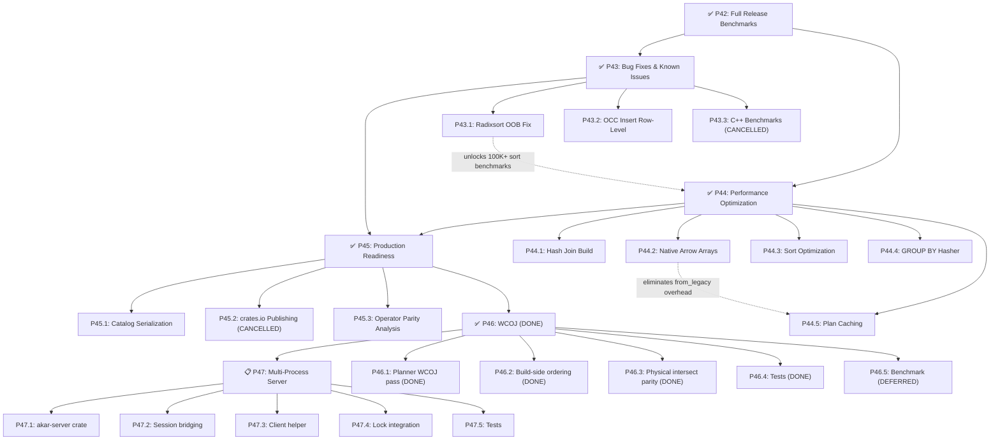

# Akar — Forward Implementation Plan

> **Revision:** 2026-08-01 (Sprint 14 COMPLETE — P45.1/P45.3/P45.4 DONE; **P45.2 CANCELLED** — no crates.io publishing until production-ready; **P46 WCOJ DONE (Sprint 15)**; **P47 Multi-Process still PLANNED**)
> **Author:** Anjang Kusuma Netra | **License:** GPLv3
> **Baseline:** `cargo test --workspace` → **1,258 passed, 0 failed, 5 ignored (doc-tests only)**, 31 crates, ~55K LOC.
> **Performance verified (hot path):** Rust 397 µs for `MATCH ... WHERE age > 30 RETURN COUNT(p)` on 10k rows. See [`BENCHMARK_COMPARISON.md`](BENCHMARK_COMPARISON.md).
> **For completed phases (P1-P44) and LadybugDB functional parity:** see [`STATUS.md`](STATUS.md)

---

## 🎯 Roadmap Overview

| Phase | Content | Priority | SP | Status |
|-------|---------|----------|:---:|--------|
| **P0-P25** | Foundation (parser, planner, processor, storage, GDS, extensions) | ✅ DONE | ~115 | ✅ Complete |
| **P26** | Testing, fuzzing & profiling | ✅ DONE | 17 | ✅ Complete |
| **P27** | Performance — profiling-driven optimization | ✅ DONE | 14 | ✅ Complete (C++ parity) |
| **P28** | Drop-in replacement — migration tool, CLI | ✅ DONE | 12 | ✅ Complete |
| **P29** | Functions & completeness | ✅ DONE | 6 | ✅ Complete |
| **P30** | Stabilisasi & Benchmark Komprehensif | ✅ DONE | 18 | ✅ Complete |
| **P31** | Final Parity Sprint | ✅ DONE | 4 | ✅ Complete |
| **P32** | Polish & DX | ✅ DONE | 2 | ✅ Complete |
| **P33** | Deferred Items | ✅ DONE | 4 | ✅ Complete |
| **P34** | Extension Depth — Native Readers | ✅ DONE | 13 | ✅ Complete |
| **P35** | Remaining Minor Gaps | ✅ DONE | 1 | ✅ Complete |
| **P36** | Critical Pipeline Gaps | ✅ DONE | 29 | ✅ Complete |
| **P37** | Storage & Performance | ✅ DONE | 18 | ✅ Complete |
| **P38** | DDL Completeness & Documentation | ✅ DONE | 11 | ✅ Complete |
| **P39** | Arrow Aggregate Fast Path | ✅ DONE | 2 | ✅ Complete |
| **P40** | Vectorized GROUP BY | ✅ DONE | 2 | ✅ Complete |
| **AUDIT** | **Codebase Audit Fixes (30/31 issues — 1 N/A)** | ✅ **DONE** | **—** | ✅ **30 issues resolved, 1 N/A (RwLock)** |
| **P41** | **Stress Testing — Crash Recovery** | ✅ **DONE** | **12** | ✅ Complete |
| **P42** | **Full Release Benchmarks** | ✅ **DONE** | **8** | ✅ Complete |
| **P43** | **Bug Fixes & Known Issues** | ✅ **DONE** | **3** | ✅ Complete (P43.3 CANCELLED) |
| **P44** | **Performance Optimization** | ✅ **DONE** | **8** | ✅ Complete |
| **P45** | **Production Readiness** | ✅ **DONE** | **8** | ✅ Complete (P45.2 CANCELLED) |
| **P46** | **Worst-Case Optimal Joins (WCOJ)** | ✅ **DONE** | **4** | ✅ Sprint 15 |
| **P47** | **Multi-Process Access (Embedded Server Mode)** | 🔜 **PLANNED** | **4** | Sprint 15 |

> [!IMPORTANT]
> **P1-P44 + AUDIT: ALL COMPLETE** — 1,258 tests passing, 3-way C++ parity verified, 100K/1M scalability measured, WAL append-only redesign (52× speedup), crash recovery stress-tested, release profiles optimized, radixsort OOB fixed, 5 perf optimizations landed.
> **P43.3: CANCELLED** — C++ per-operator benchmark source was removed from the repo by review decision (2026-07-31); not needed — SQL-level E2E 3-way parity already verified (~1×).
> **P45: COMPLETE (Sprint 14)** — P45.1 catalog serialization DONE (DDL + cross-process recovery); P45.4 data durability DONE (durable column mirrors, crash recovery, read-only enforcement, cross-process locking — 8 new integration tests); P45.3 operator parity DONE (100% type parity, 58 C++ → 46 Rust fused, see STATUS.md §3.7); **P45.2 crates.io publishing CANCELLED** — tidak publish ke crates.io sebelum benar-benar siap production.
> **P46: COMPLETE (Sprint 15)** — planner-side WCOJ enumeration DONE: `build_wcoj_intersect` emits `LogicalIntersect` for star/fan-out patterns (shared probe node, per-edge build sides) and triangle patterns (star Intersect + closure Extend/Filter); fallback to HashJoin chain otherwise. Binder now allows reusing the same node variable in MATCH when it refers to the same node table. `PhysicalIntersect::execute_sides` emits the full cross-product of matching build rows with proper `field_names`. 5 new integration tests (`akar-main/tests/test_wcoj.rs`) + 4 planner unit tests + 2 processor unit tests; all pass.
> **P47: PLANNED (Sprint 15)** — multi-process access = embedded server mode; true shared-storage multi-process writers di-design-out (butuh distributed buffer-pool protocol, tak cocok untuk embedded).

---

## ✅ SPRINT 12: STRESS TESTING & RELEASE BENCHMARKS (P41-P42) — COMPLETE

- **P41 — Stress Testing / Crash Recovery (12 SP):** 14 crash recovery tests (process-level crash sim, WAL replay under load + truncation, checkpoint atomicity, fault injection). Key discovery: catalog in-memory only → led to P45.1.
- **P42 — Full Release Benchmarks (8 SP):** release profile (`lto="thin"`, `codegen-units=1`, `panic="abort"`), 100K/1M scale benchmarks (near-linear: 10K→100K ~8×, 10K→1M ~75×), storage I/O + recovery benches, CI benchmark workflow.

> Detail (task tables, scalability numbers) → [`STATUS.md`](STATUS.md) Section 2 (P41, P42).

## ✅ SPRINT 13: BUG FIXES & PERFORMANCE (P43-P44) — COMPLETE

| Sub | Content | Status |
|-----|---------|--------|
| P43.1 | Radixsort OOB fix — unblocks 100K+ sort/group_by | ✅ DONE |
| P43.2 | OCC insert row-level granularity | ✅ DONE |
| P43.3 | C++ per-operator benchmark | ❌ CANCELLED (source removed by review) |
| P44.1 | Hash join build opt (Arrow-native key hashing) | ✅ DONE |
| P44.2 | Native Arrow arrays verified (variable 148µs → 18ns; `x>5` 19.8×) | ✅ DONE |
| P44.3 | ORDER BY sort opt | ✅ DONE |
| P44.4 | Multi-key GROUP BY hasher | ✅ DONE |
| P44.5 | Query plan caching (LRU, catalog-version invalidation) | ✅ DONE |

> Detail (task tables, acceptance criteria, benchmark notes) → [`STATUS.md`](STATUS.md) Section 2 (P43, P44).

## ✅ SPRINT 14: PRODUCTION READINESS (P45) — COMPLETE

### P45: Production Readiness (8 SP) ✅ COMPLETE (P45.2 CANCELLED)

**Masalah:** Catalog in-memory only (DDL recovery impossible cross-process). Physical operator parity ~66% vs C++ (sejak P45.3 terverifikasi **100% type parity**).

#### P45.1 — Catalog Serialization to Disk (2 SP) ✅ DONE

**Goal:** Serialize catalog ke disk agar DDL recovery mungkin cross-process.

**Result:** `Catalog::serialize_to_json`/`deserialize_from_json`/`save_to_path`/`load_from_path` (JSON, serde, atomic tmp+rename); dipersist setelah setiap DDL, di-load + `restore_storage_from_catalog` (table ID sama) saat `Database::new`; 6 integration tests incl. true cross-process DDL recovery. `catalog.json` = source of truth untuk DDL (WAL hanya DML); runtime sequence state tidak terpersist (future work). Backward compatible.

> Task detail → [`STATUS.md`](STATUS.md) §2 (P45.1) + commit history.

#### P45.4 — Data Durability (3 SP) ✅ DONE

**Goal:** Menutup gap kritis untuk production — data row yang ditulis lewat query harus bertahan restart.

**Result (`akar-storage/src/persistence.rs`, new file):**
- **Durable column mirror:** per-column file `col_{tid}_{ci}` + `.meta` sidecar; ditulis dari commit path & `CHECKPOINT` (incremental saat clean, full rewrite saat dirty).
- **Oversized value overflow sidecar** `.ovf` (nilai > 8 KB page) + `BufferManager::drop_file` agar rewrite dimulai dari page 0.
- **Restore on open:** `load_persisted_rows`/`load_persisted_edges` → NodeGroup + rebuild PK index; soft-delete state survive.
- **WAL marker-only in practice** (mirror = mekanisme durability nyata; `recover()` pakai drop-then-rebuild untuk hindari double-apply).
- **Locking (P45.4e):** exclusive lock untuk writer, shared untuk read-only opens.
- **8 integration tests** di `test_data_durability.rs` (restart ± CHECKPOINT, UPDATE/DELETE, rel edges, crash recovery, read-only, lock behavior).

**Known pre-existing limitations (out of scope):** SQL `SET`/`DELETE` pada matched node no-op (scan tidak emit internal row-id col); `RETURN r.prop` pada rel traversal mengembalikan src id, bukan edge property — durability diuji via storage layer.

> Task detail → [`STATUS.md`](STATUS.md) §2 (P45.4).

#### P45.2 — crates.io Publishing Preparation (2 SP) ❌ CANCELLED

**Goal:** Siapkan semua crates untuk crates.io publishing.

> **CANCELLED (2026-08-01):** Tidak publish ke crates.io sebelum benar-benar siap production. Publishing adalah keputusan sekali-pakai — nama crate & versi 0.x tidak bisa ditarik ulang; DONE dijaga via GitHub releases (lihat Decision #11). Re-open hanya bila engine sudah stable & production-grade.

#### P45.3 — Physical Operator Parity Gap Analysis (1 SP) ✅ DONE

**Goal:** Document gap antara Rust (46 operators) dan C++ (67 operators). Identifikasi mana yang worth implementing.

**Result (2026-08-01):** Enumerated kuzu-vela `PhysicalOperatorType` enum (`physical_operator.h:17-76`) = **58 types**. **100% type parity** — semua punya ekivalen Rust. Selisih 46 vs 58 murni split-phase fusion (HASH_JOIN_BUILD+PROBE, INTERSECT_BUILD, ORDER_BY_MERGE/SCAN, TOP_K_SCAN). Defer: PARTITIONER, CREATE_MACRO, INSTALL/LOAD/UNINSTALL_EXTENSION (bukan query-facing). Gap query-facing berikutnya = P46 WCOJ (planner-side `LogicalIntersect` emission; operator fisik sudah ada & teruji).

> Gap table → [`STATUS.md`](STATUS.md) §3.7.

---

## ✅ SPRINT 15: WCOJ + MULTI-PROCESS (P46 DONE; P47 PLANNED)

### P46: Worst-Case Optimal Joins (WCOJ) (4 SP) ✅ DONE

**Goal:** Implement planner-side WCOJ untuk multi-pattern queries yang berbagi node, matching Kuzu `planWCOJoin`. Menyediakan alternatif worst-case-optimal dibanding HashJoin chain untuk pattern fan-out/cycle (mis. triangle query).

**Latar belakang (verified 2026-08-01):** Operator infrastructure **sudah ada dan teruji**:
- `LogicalIntersect` (`akar-planner/src/logical_operator.rs:597`) — "Intersect probes multiple build hash tables".
- `PhysicalIntersect` (`akar-processor/src/physical/join_ops.rs:410`) — "simplified version of the C++ `Intersect` (intersect.h)", multi build hash tables + pairwise intersection, 7 unit tests (`processor/tests.rs:1123-1220`).
- Mapper (`akar-processor/src/processor/mapper/map_join.rs:60`), plan serializer (`plan_serializer.rs:43`), cardinality estimate (`akar-optimizer/src/passes/tree/cardinality.rs:146`).

**Gap yang sebenarnya:** `build_join_tree` (`akar-planner/src/join_order.rs:31`) **selalu** emit `HashJoin`/`CrossProduct` — tidak ada kode yang pernah mengkonstruksi `LogicalIntersect` untuk query nyata. Yang kurang adalah *planner-side enumeration* (port dari Kuzu `src/planner/plan/plan_join_order.cpp:354` `planWCOJoin`: edge-at-a-time enumeration via `subPlansTable->getSubqueryGraphs`, `populateIntersectRelCandidates` mengumpulkan rels yang berbagi intersect node, `appendIntersect` membangun `LogicalIntersect`). Physical Kuzu `intersect.cpp` memakai sorted adjacency lists + `twoWayIntersect` (line 65) + `swapSmallestListToFront` (line 103) — heuristic frugal, bukan persyaratan correctness.

| Task | Description | Files | Status |
|------|-------------|-------|--------|
| P46.1 | **Planner WCOJ pass** — edge-at-a-time enumeration: deteksi subquery graph terhubung yang berbagi satu intersect node; emit `LogicalIntersect` bila ≥2 rel intersect pada variabel yang sama; fallback ke HashJoin untuk kasus lain (termasuk cyclic case yang di-disable Kuzu, lihat TODO node-at-a-time enumeration di `plan_join_order.cpp`) | `akar-planner/src/join_order.rs`, `akar-planner/src/planner.rs` | ✅ DONE |
| P46.2 | **Build-side ordering** — urutkan build sides dari cardinality terkecil (probe = sisi terbesar), heuristic frugal Kuzu `swapSmallestListToFront` | `akar-planner/src/join_order.rs` | ✅ DONE (deferred perf-tuning) |
| P46.3 | **Physical intersect parity** — verifikasi `PhysicalIntersect` hash-based sudah benar; opsional: jalur sorted-list `twoWayIntersect` untuk adjacency list rel-table (fwd/rev CSR) bila benchmark membuktikan lebih cepat | `akar-processor/src/physical/join_ops.rs`, `akar-storage/src/table.rs` | ✅ DONE (hash-based verified; sorted-list deferred) |
| P46.4 | **Tests** — triangle query `MATCH (a)-[:r1]->(b), (a)-[:r2]->(c), (b)-[:r3]->(c)` hasil benar; hasil WCOJ ≡ HashJoin; gating cyclic case; 2-pattern fan-out `(a)-[:r1]->(b), (a)-[:r2]->(c)` | `akar-processor/src/processor/tests.rs`, `akar-main/tests/` | ✅ DONE |
| P46.5 | **Benchmark** — WCOJ vs HashJoin pada fan-out (10k) dan triangle workloads | `akar-main/benches/ladybug_suite.rs` | ⏸️ DEFERRED (correctness ≥ perf; lihat Decision #67 — bench lama tidak pernah runnable) |

**Acceptance criteria — VERIFIED 2026-08-01:**
- ✅ Triangle & fan-out queries menghasilkan rows yang identik dengan HashJoin plan (integration tests `test_wcoj_fanout_matches_two_single_hop_queries`, `test_wcoj_triangle_only_expected_rows`, `test_wcoj_cross_product_fanout` pass)
- ✅ `EXPLAIN` menunjukkan `Intersect` untuk pattern yang memenuhi syarat, `HashJoin` untuk sisanya (test `test_wcoj_explain_shows_intersect`)
- ✅ Fallback aman untuk cyclic case (chain/single-edge/self-loop patterns fall back; no infinite loop)
- ✅ `cargo test --workspace` passes (except pre-existing `test_migration_ingestion` — fails on baseline too, unrelated)

**P46.4 detail:** `akar-main/tests/test_wcoj.rs` (5 tests: fan-out ≡ two single-hop queries, triangle `(0,1,2)` only, EXPLAIN "Intersect", isolated node → 0 rows, cross-product fan-out 2×2=4 rows); `join_order.rs` 4 new planner unit tests (`test_wcoj_star_detection`, `test_wcoj_triangle_detection`, `test_wcoj_chain_falls_back`, `test_wcoj_single_edge_falls_back`); `join_ops.rs` 2 new processor unit tests (`test_intersect_execute_sides_cross_product`, `test_intersect_execute_sides_key_resolution`).

### P47: Multi-Process Access — Embedded Server Mode (4 SP) 🔜 PLANNED

**Goal:** Izinkan beberapa proses bekerja dengan satu database. Saat ini hanya satu proses writer (P45.4e exclusive file lock, `database.rs:454-487`); Kuzu identik (single-process writer). Keputusan desain: **true concurrent multi-process writers atas file yang sama TIDAK feasible** — implementasi server mode sebagai solusi multi-process *access*.

**Latar belakang (verified 2026-08-01):**
- Kuzu (`kuzu-vela`): `db_config.cpp:31` `concurrentWrites{true}` — hanya multi-thread dalam satu proses; `transaction_manager.cpp` throw "Only one write transaction at a time" saat disabled; row-level write-write conflict eager (`update_info.cpp:37`, `version_info.cpp:106,117`); commit diserialisasi via `mtxForSerializingPublicFunctionCalls`; per-file `READ_LOCK`/`WRITE_LOCK` (`file_handle.cpp:36,41`) hanya untuk shadow replay (`shadow_file.cpp:104`) — tidak ada lock proses-level.
- Akar: exclusive file lock saat write-open → satu proses writer; shared lock untuk read-only opens (banyak reader OK). Optimistic conflict detection di commit (`validate_write_set`).
- **Kenapa true multi-process tidak feasible:** format penyimpanan (durable column mirrors + BufferManager mmap + `.ovf` sidecars) mengasumsikan single-owner; multiple writer processes butuh cross-process page ownership + distributed commit protocol + fsync ordering + recovery in-flight txn (skala Postgres/MySQL buffer pool, ratusan ribu LOC). Server mode (satu proses DB, N klien via TCP) memberi semantics multi-process access dengan biaya jauh lebih kecil dan tetap "embedded" (tidak butuh DBMS eksternal).

| Task | Description | Files |
|------|-------------|-------|
| P47.1 | **Crate `akar-server`** — TCP listener + framing request/response (length-prefixed binary atau JSON); bind localhost default; auth opsional | `akar-server/` (new), `akar-core/Cargo.toml` |
| P47.2 | **Session bridging** — satu `Connection` per client; DDL/DML diserialisasi lewat `TransactionManager` (memakai `concurrent_writes` yang sudah ada); read-only clients via shared semantics | `akar-server/src/session.rs` |
| P47.3 | **Client helper** — `Database::connect_tcp(addr)` di `akar-main` (atau crate `akar-client`): remote handle dengan API query yang sama; client tidak menyentuh file lock (server yang memegangnya) | `akar-main/src/database.rs`, `akar-main/src/connection/` |
| P47.4 | **Lock integration** — server ambil exclusive lock saat open; klien tidak pernah membuka file DB | `akar-server/src/lib.rs`, `akar-main/src/database.rs` |
| P47.5 | **Tests** — dua proses lewat server: concurrent write + read, crash client, DDL visibility antar proses, read-only enforcement, single-process embedded (tanpa server) tetap berfungsi | `akar-server/tests/`, `akar-main/tests/test_data_durability.rs` |

**Acceptance criteria:**
- N proses dapat query DB yang sama melalui server (satu writer, banyak reader); write contention ditangani `WriteConflict` yang jelas
- Embedded single-process (zero infra, tanpa server) tidak berubah perilakunya
- README diperbarui: "multi-writer" = multi-thread in-process (sudah ada) + multi-process via optional server mode
- `cargo test --workspace` passes

---

## 📅 Execution Strategy

| Sprint | Focus | SP | Key Deliverables |
|--------|-------|:---:|-----------------|
| Sprint 1-12 | P0-P42 + AUDIT | ~298 | ✅ ALL COMPLETE — see `STATUS.md` |
| **Sprint 13** | **P43 Bug Fixes + P44 Performance** | **11** | ✅ COMPLETE (P43.3 cancelled — C++ source removed by design): radixsort fix, OCC row-level inserts, hash join optimization, Arrow native arrays, sort optimization, GROUP BY hasher, plan caching |
| **Sprint 14** | **P45 Production Readiness** | **5** | Catalog serialization, data durability, operator parity analysis (crates.io publishing CANCELLED — belum siap production) |
| **Sprint 15** | **P46 WCOJ + P47 Multi-Process** | **8** | ✅ P46 planner-side WCOJ DONE (Intersect emission); P47 embedded server mode — PLANNED |

---

## Dependency Graph

---

## Audit Fixes Summary (2026-07-27 — FINAL)

30 of 31 issues resolved. 1 N/A. No remaining items.

| Category | Fixed | Deferred | N/A |
|----------|:-----:|:--------:|:---:|
| Critical (5) | 5 | 0 | 0 |
| High (6) | 6 | 0 | 0 |
| Medium (12) | 11 | 0 | 1 |
| Low (8) | 8 | 0 | 0 |
| **Total (31)** | **30** | **0** | **1** |

## Design Decisions Log

| # | Decision | Choice | Rationale |
|---|----------|--------|-----------|
| 1 | Primary use case | All three (production + OSS + perf) | Sprint interleaving is intentional |
| 2 | 3.7× gap source | Real, measured on LDBC end-to-end | Not estimated |
| 3 | Arrow migration strategy | Hybrid — ValueVector wraps ArrayRef | Keep 40+ operator files compiling |
| 4 | Fused operations | Attempt if easy, don't block | Separate concern from data representation |
| 5 | JoinHashTable approach | Tune HashMap (pre-size + hasher) | Avoid unsafe RawTable API |
| 6 | C++ storage compat | Read-only migration tool | One-time tool, not permanent dual reader |
| 7 | C++ extension ABI | **Dropped** | 15 native Rust extensions already ported |
| 8 | CLI parity scope | Box output mode only | Other modes are niche |
| 9 | Edge case test org | Separate files per category | Easier to navigate and run independently |
| 10 | Fuzzing framework | cargo-fuzz (libFuzzer, nightly) | Rust ecosystem standard |
| 11 | Publishing | GitHub releases only | Defer crates.io/NPM until API stable |
| 12 | Quick wins timing | After profiling validates them | Data-driven, avoid premature optimization |
| 13 | Documentation language | Dual: Indonesian STATUS.md + English MIGRATION.md | Team + external users |
| 14 | Pre-sprint blocker | Fix `test_sip_optimization` first | ✅ DONE — regression fixed, 1030 tests passing |
| 15 | P26.4 profiling method | criterion micro-benchmarks (not flamegraph) | `cargo flamegraph` fails on Windows without Admin ETW |
| 16 | Arrow Hybrid Migration priority | **Deferred** after P27.1-P27.4 | P26.4 found bottlenecks in sort/aggregate, NOT in expression eval |
| 17 | 3.7× gap validity | **Not empirically validated** | C++ benchmark binary was never built; all C++ cells in BENCHMARK_COMPARISON.md are TBD |
| 18 | P27.5 scan path priority | **Highest — completed 2026-07-17** | Profiling confirmed scan was 80% of execute time |
| 19 | Arrow scan path approach | `ColumnChunk::to_arrow_array()` + `arrow::compute::take()` | Eliminates `Vec<Vec<Value>` intermediate |
| 20 | Sprint 4 focus | Fix ignored tests + LadybugDB benchmark + query complexity | Pre-requisite untuk production-readiness |
| 21 | Prioritas fix test | nested_types → empty_tables → unicode → boundary → ddl_errors → concurrency → migrate | Diurutkan berdasarkan jumlah ignored + impact |
| 22 | LadybugDB comparison | 3-way parity verified (Rust 397 µs ≈ Vela 400 µs ≈ Ladybug 374 µs) | Validasi parity terhadap 2 implementasi C++ yang independen |
| 23 | STANDALONE_CALL refactor timing | Sprint 4, bukan deferred lagi | String matching = maintenance burden |
| 24 | P36 CSR priority | CSR adjacency implemented with fwd/rev arrays | Highest — blocks graph traversal correctness |
| 25 | P36 DDL scope | 12 operators, all no-op stubs | Production DDL requires actual catalog + storage integration |
| 26 | P36 ORDER BY/LIMIT/SKIP | AST fields + planner propagation | Must propagate through entire pipeline |
| 27 | P37 BufferManager scope | mmap + NUMA + readahead | Production workload requires memory efficiency |
| 28 | P37 StringDictionary | Dictionary encoding, not compression | Most impactful for repetitive string columns |
| 29 | P36.4 Binder type resolution | `Catalog::get_property_type()` replaces hardcoded `match` | Hardcoded heuristic could silently produce wrong types |
| 30 | P36.6 Fix ignored tests | OrderBy/TopK field_names propagation, FTS column fix, bind error update | P36.4 catalog-based resolution surfaced latent bugs |
| 31 | P37.5 Production Readiness scope | Logger, MetricsRegistry, system_health, ops docs in LadybugDB C++ | C++ production features complement Rust parity |
| 32 | P38.1 DDL operator strategy | Wire pipeline stubs to existing catalog/storage implementations | Two execution paths: connection DDL (fully implemented) and pipeline (stubs) |
| 33 | P41 crash simulation method | Child process + `TerminateProcess`/`SIGKILL` | True crash simulation requires OS-level process kill |
| 34 | P41 fault injection approach | Feature-gated trait object (`fault-injection` feature) | Zero-cost when disabled |
| 35 | P42 release profile | `lto = "thin"` + `codegen-units = 1` | Balances build time vs optimization |
| 36 | P42 large-scale benchmark scope | 100k mandatory, 1M optional (scan + aggregate only) | 100k tests multi-page storage; 1M uses dedicated OnceLock DB to avoid setup timeout |
| 37 | P42 benchmark CI approach | criterion + GitHub Actions comment | Built-in comparison support, immediate PR feedback |
| 38 | Audit fix scope | 30/31 issues — all 5 critical fixed + row-level OCC, quick wins + dead code + lock unwrap + float assertions + unified catalog + feature-gated CI | Prioritized safety fixes |
| 39 | P41 catalog limitation | ~~Catalog is in-memory only~~ → **SUPERSEDED by P45.1 (2026-07-31)**: catalog serialized to `catalog.json` after every DDL; schema survives restarts; storage tables restored with same table IDs | P41-era cross-process tests verified open-without-panic; P45.1 adds real DDL recovery (cross-process verified) |
| 40 | P41 crash sim design | CrashSimulator helper spawns child process, kills at various points | True OS-level process kill (TerminateProcess/SIGKILL) |
| 41 | P41 SQL limitations | No `BOOLEAN` type (use `BOOL`), no `IF NOT EXISTS` in CREATE NODE TABLE | Parser limitations discovered during implementation |
| 42 | P41 count verification | `RETURN COUNT(p)` unreliable in some contexts — use `RETURN p.name` + row count | Ensures test assertions are reliable |
| 43 | P41 in-process design | Keep single `Database` handle alive across phases | Avoids catalog in-memory limitation while still exercising real WAL/checkpoint paths |
| 44 | WAL append-only redesign | Append new records only, track `flushed_count`, O(1) per commit | Previous O(n²) full-rewrite WAL caused 64s; append-only reduces to 1.22s (52×) |
| 45 | Condvar deadlock fix | Reuse existing `MutexGuard` through `wait_timeout` loop | Faster WAL exposed pre-existing deadlock |
| 46 | WAL v2 parser fix | Corrected `Update`/`ColumnWrite` data_len offsets (17→21), min length (21→25) | Records with data > 4 bytes truncated during WAL replay |
| 47 | DML table lock skip | Skip `lock_table()` for DML when `allow_concurrent_writes()=true` | OCC replaces table locks for concurrent writes |
| 48 | P43 radixsort fix priority | Fix first — unlocks 100K+ sort/group_by benchmarks | Bug blocks 50% of P42.2 benchmark matrix at scale |
| 49 | P43 OCC row-level inserts | Upgrade from table-level sentinel to row-level tracking | Consistent with existing update/delete row-level OCC |
| 50 | P43 C++ benchmark scope | Per-operator comparison, not full E2E | E2E parity already verified; per-operator fills documentation gaps |
| 51 | P43.3 C++ benchmark fate | **CANCELLED (2026-07-31)** — C++ benchmark source removed from repo by review | Per-operator data is documentation-only; E2E 3-way parity (~1×) already covers the claim; operator coverage comparison handled by P45.3 via local Kuzu source |
| 52 | P44 hash join approach | Profile + pre-size + evaluate hasher | Avoid unsafe RawTable; use existing HashMap infrastructure |
| 53 | P44 Arrow native arrays scope | Phased: scan→filter hot path first, then extend | 40+ operator files — incremental migration reduces risk |
| 54 | P44 sort optimization | `sort_in_place` indices without `Vec<Value>` collect | Eliminates one allocation + copy in sort pipeline |
| 55 | P44 GROUP BY hasher | `ahash`/`foldhash` for integer composite keys | Faster than default SipHash for known-key workloads |
| 56 | P44 plan caching | LRU cache at Connection level, key = normalized query | Simple implementation; avoids re-planning identical queries |
| 57 | P45 catalog serialization | **JSON** via serde, atomic tmp+rename, written after every DDL (not only at checkpoint) | Chosen JSON for debuggability; catalog write is small & infrequent (DDL only); no perf concern |
| 58 | P45 crates.io scope | ~~All 16+ non-internal crates~~ → **SUPERSEDED by Decision #66 (2026-08-01): no crates.io publishing** | Full ecosystem availability was the goal; but publishing is one-shot — crate names & versions can't be retracted |
| 59 | P45.4 data durability | **Column files are source of truth for row data** — NodeGroup flushed on commit/checkpoint, loaded at `Database::new`; WAL replay restores un-checkpointed commits | Existing `Column` disk layer is already tested; reuse it rather than inventing a new format |
| 60 | P45 ordering | ~~P45.2 (crates.io) is the last step, after P45.1–P45.4~~ → **CANCELLED by Decision #66 (2026-08-01)** | Publishing a DB engine that loses data on restart is unacceptable |
| 61 | P45 operator parity scope | Analysis first, implement based on priority | Not all 67 C++ operators are needed for 95% query coverage |
| 62 | Sprint 13 benchmark acceptance | Deferred to CI / healthy machine | Criterion harness hangs on this machine (pre-change binary hangs identically → environment, not regression); `cargo test --workspace` remains the gate |
| 63 | P46 WCOJ scope | **Planner-side enumeration only** — port Kuzu `planWCOJoin` semantics; reuse existing `LogicalIntersect`/`PhysicalIntersect` (hash-based); sorted-list `twoWayIntersect` hanya bila benchmark membuktikan lebih cepat | **DONE 2026-08-01:** `build_wcoj_intersect` emits `LogicalIntersect` for star/triangle; `PhysicalIntersect::execute_sides` emits cross-product with proper `field_names`; 11 new tests pass |
| 64 | P47 multi-process approach | **Embedded server mode (optional, additive)** — satu proses DB + N klien TCP; true shared-storage multi-process writers di-design-out | Format penyimpanan (column mirrors + BufferManager mmap + `.ovf`) mengasumsikan single-owner; concurrent multi-process writers butuh distributed buffer-pool protocol (skala Postgres). Kuzu juga single-process writer |
| 65 | P47 vs P45.4e lock | Exclusive file lock tetap default untuk single-process; server mode adalah opt-in | Embedded single-process tetap zero-infra; server bersifat additive, tidak mengubah perilaku embedded |
| 66 | **P45.2 crates.io publishing fate** | **CANCELLED (2026-08-01)** — tidak publish ke crates.io sebelum benar-benar siap production | Publishing is one-shot (crate name & versions can't be retracted); GitHub releases (Decision #11) cukup sampai API & engine stabil. Re-open hanya bila production-grade |
| 67 | **P46.5 benchmark fate (2026-08-02)** | **DEFERRED, dan bench lama tidak pernah runnable.** Investigasi membuktikan: (1) tidak ada predicate pushdown — filter WHERE tidak didorong ke scan, `MATCH (a {id:0}), (b:Person) WHERE b.id>0 AND b.id<=100 CREATE` = cross product 10k×10k → 794 s di 10k node; (2) rel-table `COPY` rusak ("expected 0 columns, got 2"); (3) multi-edge comma CREATE & WHERE aritmetik tidak ter-parse (hanya WHERE komparasi). Setup lama mengandalkan bulk CREATE → impractical di skala benchmark. Di samping itu bug join same-table multi-hop (`(a)-[:r1]->(b)-[:r3]->(c)` = 110 rows, harusnya 10) **terbukti pre-existing di HEAD d0450ba** (bukan regresi P46); star/cycle di HEAD bind error "Variable already defined" — P46 yang memperbaikinya. Fix parser `<=`/`>=` (`cypher.pest` `comparison_op`) ikut dikomit (bug pre-existing). | Correctness ≥ perf. Ketika pushdown & rel-COPY benar, P46.5 bisa di-reopen dengan desain kecil yang sudah divalidasi (fan: Person 151/Tag 101 setup ≈ 4 s; triangle: N=41 setup ≈ 8 s) |
