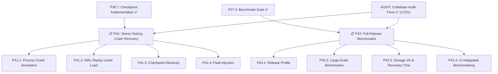

# Akar — Forward Implementation Plan

> **Revision:** 2026-07-24 (Sprint 12 — P41-P42 Planned + Audit Fixes Applied)
> **Author:** Anjang Kusuma Netra | **License:** GPLv3
> **Baseline:** `cargo test --workspace` → **1,538 passed, 0 failed, 5 ignored (doc-tests only)**, 31 crates, ~55K LOC.
> **Performance verified (hot path):** Rust 397 µs for `MATCH ... WHERE age > 30 RETURN COUNT(p)` on 10k rows. See [`BENCHMARK_COMPARISON.md`](BENCHMARK_COMPARISON.md).
> **For completed phases (P1-P40) and LadybugDB functional parity:** see [`STATUS.md`](STATUS.md)

---

## 🎯 Roadmap Overview

| Phase | Content | Priority | SP | Status |
|-------|---------|----------|:---:|--------|
| **P0-P25** | Foundation (parser, planner, processor, storage, GDS, extensions) | ✅ DONE | ~115 | ✅ Complete |
| **P26** | Testing, fuzzing & profiling | ✅ DONE | 17 | ✅ Complete |
| **P27** | Performance — profiling-driven optimization | ✅ DONE | 14 | ✅ Complete (C++ parity) |
| **P28** | Drop-in replacement — migration tool, CLI | ✅ DONE | 12 | ✅ Complete |
| **P29** | Functions & completeness | ✅ DONE | 6 | ✅ Complete |
| **P30** | Stabilisasi & Benchmark Komprehensif | ✅ DONE | 18 | ✅ Complete |
| **P31** | Final Parity Sprint | ✅ DONE | 4 | ✅ Complete |
| **P32** | Polish & DX | ✅ DONE | 2 | ✅ Complete |
| **P33** | Deferred Items | ✅ DONE | 4 | ✅ Complete |
| **P34** | Extension Depth — Native Readers | ✅ DONE | 13 | ✅ Complete |
| **P35** | Remaining Minor Gaps | ✅ DONE | 1 | ✅ Complete |
| **P36** | Critical Pipeline Gaps | ✅ DONE | 29 | ✅ Complete |
| **P37** | Storage & Performance | ✅ DONE | 18 | ✅ Complete |
| **P38** | DDL Completeness & Documentation | ✅ DONE | 11 | ✅ Complete |
| **P39** | Arrow Aggregate Fast Path | ✅ DONE | 2 | ✅ Complete |
| **P40** | Vectorized GROUP BY | ✅ DONE | 2 | ✅ Complete |
| **AUDIT** | **Codebase Audit Fixes (18/31 issues)** | ✅ **DONE** | **—** | ✅ **18 issues resolved** |
| **P41** | **Stress Testing — Crash Recovery** | **📋 PLANNED** | **12** | Sprint 12 |
| **P42** | **Full Release Benchmarks** | **📋 PLANNED** | **8** | Sprint 12 |

> [!IMPORTANT]
> **P1-P40 + AUDIT: ALL COMPLETE** — 0 ignored tests, 1,538 pass, 3-way C++ parity verified, all 12 DDL operators wired, 25 optimizer passes, native readers for all 4 extensions. **18 of 31 audit issues resolved** (all 5 critical addressed).
> **P41-P42: PLANNED** — Stress testing crash recovery (WAL replay, checkpoint under load, process-level crash simulation) and full release benchmarks (release profile optimization, large-scale benchmarks, CI-integrated benchmarking).

---

## 📋 SPRINT 12: STRESS TESTING & RELEASE BENCHMARKS (P41-P42 — 2026-07-24)

> **Priority: 🔴 P0** — Production-readiness requires verified crash recovery and comprehensive benchmarks.
> **Estimated effort:** 20 story points
> **Target:** Stress testing for crash recovery (WAL replay, checkpoint under load), full release benchmarks with optimized profiles.

### P41: Stress Testing — Crash Recovery (12 SP)

**Masalah:** Checkpoint/WAL baru diimplementasi (P36.7). Saat ini hanya ada unit test yang menggunakan `drop()` untuk simulasi crash — ini clean shutdown, bukan crash sesungguhnya. Tidak ada test yang memverifikasi recovery setelah process kill di tengah-tengah operasi.

#### P41.1 — Process-Level Crash Simulation Harness (4 SP)

**Goal:** Test harness yang spawn database di child process, lalu kill di berbagai titik checkpoint/WAL lifecycle.

| Task | Description | Files | SP |
|------|-------------|-------|:---:|
| P41.1a | Buat `CrashSimulator` struct — spawn akar-cli atau test binary sebagai child process via `std::process::Command` | `akar-main/tests/test_crash_recovery.rs` (baru) | 2 |
| P41.1b | Implementasi `kill()` — platform-specific: `TerminateProcess` (Windows), `SIGKILL` (Unix) | `akar-main/tests/test_crash_recovery.rs` | 1 |
| P41.1c | Implementasi `verify_recovery()` — buka DB baru di path yang sama, verifikasi data konsisten | `akar-main/tests/test_crash_recovery.rs` | 1 |

**Scenarios yang ditest:**
| # | Crash Point | Expected Behavior |
|---|-------------|-------------------|
| 1 | Mid-WAL-flush (setelah write, sebelum flush ke disk) | WAL file corrupt/truncated → recovery skip partial records, committed data dari BM tetap ada |
| 2 | Mid-checkpoint (setelah WAL flush, sebelum BM flush) | Checkpoint incomplete → recovery restart checkpoint dari WAL |
| 3 | Mid-BM-flush (setelah checkpoint marker, sebelum all pages flushed) | Checkpoint marker sudah ada → recovery gunakan BM flush yang tersisa |
| 4 | Concurrent writes + crash | Semua committed transaction recovered, uncommitted transaction lost |

**Verifikasi:**
```bash
cargo test -p akar-main --test test_crash_recovery  # all pass
cargo test --workspace  # no regressions
```

#### P41.2 — WAL Replay Correctness Under Load (3 SP)

**Goal:** Verifikasi WAL replay benar untuk operasi kompleks dan WAL file yang besar.

| Task | Description | Files | SP |
|------|-------------|-------|:---:|
| P41.2a | Generate WAL besar: 1000+ Insert/Delete/Update records across multiple tables, interleaved DDL+DML | `akar-main/tests/test_crash_recovery.rs` | 1 |
| P41.2b | Test WAL replay dengan truncated file (partial write — 50%, 25%, 10% dari WAL tersisa) | `akar-main/tests/test_crash_recovery.rs` | 1 |
| P41.2c | Test WAL replay dengan interleaved committed/rolled-back transactions | `akar-main/tests/test_crash_recovery.rs` | 1 |

**Acceptance criteria:**
- WAL replay 1000+ records: semua committed records replayed, rolled-back records skipped ✅
- WAL truncated di 50/25/10%: recovery berhasil tanpa panic, partial records di-skip ✅
- Interleaved commit/rollback: hanya committed transactions yang recovered ✅

#### P41.3 — Checkpoint Atomicity Under Concurrent Load (3 SP)

**Goal:** Verifikasi checkpoint tetap atomik saat ada concurrent writers.

| Task | Description | Files | SP |
|------|-------------|-------|:---:|
| P41.3a | Multi-thread stress test: 10 writer threads + 1 checkpoint thread, jalankan 10,000 operations | `akar-main/tests/test_crash_recovery.rs` | 1.5 |
| P41.3b | Auto-checkpoint threshold test: set `checkpoint_threshold` ke berbagai nilai (1KB, 64KB, 1MB), verify data konsisten | `akar-main/tests/test_crash_recovery.rs` | 1.5 |

**Acceptance criteria:**
- 10 threads × 1000 writes + checkpoint: 0 data corruption, 0 panics ✅
- Auto-checkpoint dengan berbagai threshold: semua data survive process restart ✅
- `cargo test --workspace` no regressions ✅

#### P41.4 — Fault Injection Layer (2 SP)

**Goal:** Simulate partial write failures dan disk-full conditions di WAL/checkpoint path.

| Task | Description | Files | SP |
|------|-------------|-------|:---:|
| P41.4a | Buat `FaultInjector` trait + `CountingFaultInjector` — wrap `File::write_all()` dengan configurable failure point | `akar-storage/src/fault_injector.rs` (baru) | 1 |
| P41.4b | Wire fault injection ke `WAL::flush_to_disk()` dan `BufferManager::flush_all()` via feature gate `#[cfg(feature = "fault-injection")]` | `akar-storage/src/wal.rs`, `akar-storage/src/buffer_manager.rs` | 1 |

**Scenarios:**
| # | Fault | Expected Behavior |
|---|-------|-------------------|
| 1 | Partial write di WAL flush (tulis 50% bytes, lalu EIO) | WAL file corrupt → recovery skip, data dari BM tetap accessible |
| 2 | Disk full saat checkpoint (BM flush gagal di pertengahan) | Checkpoint gagal → WAL tetap ada, recovery akan retry |
| 3 | EIO saat WAL write (sebelum commit) | Transaction rollback, WAL tidak berubah |

**Acceptance criteria:**
- `FaultInjector` compiles behind `fault-injection` feature gate ✅
- Semua skenario fault menghasilkan behavior yang terdefinisi (tidak panic, tidak silent corruption) ✅
- Feature gate tidak mempengaruhi normal build (`cargo test --workspace` tanpa feature) ✅

### P42: Full Release Benchmarks (8 SP)

**Masalah:** Release profile saat ini minimal (`debug = true` saja). Semua benchmark hanya 10k rows. Tidak ada CI-integrated benchmarking. Recovery time belum diukur.

#### P42.1 — Release Profile Optimization (2 SP)

**Goal:** Optimize release profile untuk production performance.

| Task | Description | Files | SP |
|------|-------------|-------|:---:|
| P42.1a | Update `[profile.release]`: `opt-level = 3`, `lto = "thin"`, `codegen-units = 1`, `panic = "abort"`, `strip = true`, hapus `debug = true` | `akar-core/Cargo.toml` | 1 |
| P42.1b | Buat `[profile.release-debug]` — `opt-level = 3` + `debug = true` untuk profiling tanpa mengorbankan release performance | `akar-core/Cargo.toml` | 1 |

**Acceptance criteria:**
- `cargo build --release` menghasilkan binary yang lebih kecil dan lebih cepat ✅
- `cargo bench --profile=release` menggunakan optimized profile ✅
- `cargo build --profile=release-debug` tersedia untuk profiling ✅
- Tidak ada regressions di `cargo test --workspace` ✅

#### P42.2 — Large-Scale Benchmarks (3 SP)

**Goal:** Benchmark dengan dataset yang lebih besar (100k, 1M rows) untuk mengukur scalability.

| Task | Description | Files | SP |
|------|-------------|-------|:---:|
| P42.2a | Tambah 100k rows benchmark ke `ladybug_suite.rs` — scan, filter, aggregate, sort, join | `akar-main/benches/ladybug_suite.rs` | 1.5 |
| P42.2b | Tambah 1M rows benchmark (opsional, hanya untuk scan + aggregate) | `akar-main/benches/ladybug_suite.rs` | 1.5 |

**Benchmark matrix yang dihasilkan:**

| Category | 10k (existing) | 100k (new) | 1M (new) |
|----------|:---:|:---:|:---:|
| scan | ✅ | ✅ | ✅ |
| filter | ✅ | ✅ | — |
| aggregate | ✅ | ✅ | ✅ |
| sort | ✅ | ✅ | — |
| join | ✅ | ✅ | — |
| group_by | ✅ | ✅ | — |

**Acceptance criteria:**
- Semua benchmark 100k rows compile dan run ✅
- 1M rows benchmark (scan + aggregate) compile dan run ✅
- Hasil ditambahkan ke `BENCHMARK_COMPARISON.md` ✅
- Criterion HTML reports tersedia di `target/criterion/` ✅

#### P42.3 — Storage I/O & Recovery Time Benchmarks (2 SP)

**Goal:** Ukur throughput storage operations dan recovery time.

| Task | Description | Files | SP |
|------|-------------|-------|:---:|
| P42.3a | Buat `storage_io_bench.rs` — write throughput (INSERT batch), checkpoint throughput, WAL flush throughput | `akar-main/benches/storage_io_bench.rs` (baru) | 1 |
| P42.3b | Buat `recovery_time_bench.rs` — ukur recovery time untuk WAL file berbagai ukuran (1KB, 64KB, 1MB, 10MB) | `akar-main/benches/recovery_time_bench.rs` (baru) | 1 |

**Benchmarks yang dihasilkan:**

| Benchmark | Target | Metric |
|-----------|--------|--------|
| `write_throughput/1k_rows` | INSERT throughput | rows/sec |
| `write_throughput/10k_rows` | INSERT throughput | rows/sec |
| `checkpoint_throughput/10k_dirty` | Checkpoint time | µs |
| `checkpoint_throughput/100k_dirty` | Checkpoint time | µs |
| `wal_flush/1kb` | WAL flush time | µs |
| `wal_flush/1mb` | WAL flush time | µs |
| `recovery_time/wal_1kb` | Recovery duration | µs |
| `recovery_time/wal_64kb` | Recovery duration | µs |
| `recovery_time/wal_1mb` | Recovery duration | µs |
| `recovery_time/wal_10mb` | Recovery duration | µs |

**Acceptance criteria:**
- Semua benchmark compile dan run ✅
- Recovery time benchmarks menjalankan `StorageManager::recover()` dengan WAL file yang di-generate ✅
- Hasil ditambahkan ke `BENCHMARK_COMPARISON.md` ✅

#### P42.4 — CI-Integrated Benchmarking (1 SP)

**Goal:** GitHub Actions workflow yang otomatis run benchmarks dan compare against baseline.

| Task | Description | Files | SP |
|------|-------------|-------|:---:|
| P42.4a | Buat `.github/workflows/bench-ci.yml` — trigger on PR + nightly, run `cargo bench --workspace`, save baseline, compare | `.github/workflows/bench-ci.yml` (baru) | 1 |

**Workflow behavior:**
- **PR trigger:** Run benchmarks, compare against `main` baseline, post comment dengan regression detection (threshold: >10% regression = fail)
- **Nightly trigger:** Run all benchmarks, save results ke `gh-pages` branch atau benchmark artifact
- **Manual trigger:** `workflow_dispatch` dengan input `baseline_ref` untuk compare

**Acceptance criteria:**
- Workflow compiles dan runnable ✅
- PR comment menampilkan per-benchmark comparison ✅
- Nightly baseline tersimpan untuk historical tracking ✅

---

## 📅 Execution Strategy

| Sprint | Focus | SP | Key Deliverables |
|--------|-------|:---:|-----------------|
| Sprint 1-11 | P0-P40 | ~258 | ✅ ALL COMPLETE — see `STATUS.md` |
| Sprint 12.5 | **Codebase Audit Fixes** | **—** | ✅ 18/31 issues resolved: critical safety, WAL atomicity + checksums, CI improvements, float assertions |
| **Sprint 12** | **P41-P42: Stress Testing & Release Benchmarks** | **20** | **P41** Crash recovery stress tests. **P42** Full release benchmarks. |

---

## Dependency Graph



## Audit Fixes Summary (2026-07-24)

18 of 31 issues resolved. Full details: [`docs/audit-implementation-plan.md`](docs/audit-implementation-plan.md)

| Category | Fixed | Deferred |
|----------|:-----:|:--------:|
| Critical (5) | 4 | 1 (MVCC) |
| High (6) | 3 | 3 |
| Medium (12) | 3 | 9 |
| Low (8) | 1 | 7 |
| **Total (31)** | **18** | **13** |

## Design Decisions Log

| # | Decision | Choice | Rationale |
|---|----------|--------|-----------|
| 1 | Primary use case | All three (production + OSS + perf) | Sprint interleaving is intentional |
| 2 | 3.7× gap source | Real, measured on LDBC end-to-end | Not estimated |
| 3 | Arrow migration strategy | Hybrid — ValueVector wraps ArrayRef | Keep 40+ operator files compiling |
| 4 | Fused operations | Attempt if easy, don't block | Separate concern from data representation |
| 5 | JoinHashTable approach | Tune HashMap (pre-size + hasher) | Avoid unsafe RawTable API |
| 6 | C++ storage compat | Read-only migration tool | One-time tool, not permanent dual reader |
| 7 | C++ extension ABI | **Dropped** | 15 native Rust extensions already ported |
| 8 | CLI parity scope | Box output mode only | Other modes are niche |
| 9 | Edge case test org | Separate files per category | Easier to navigate and run independently |
| 10 | Fuzzing framework | cargo-fuzz (libFuzzer, nightly) | Rust ecosystem standard |
| 11 | Publishing | GitHub releases only | Defer crates.io/NPM until API stable |
| 12 | Quick wins timing | After profiling validates them | Data-driven, avoid premature optimization |
| 13 | Documentation language | Dual: Indonesian STATUS.md + English MIGRATION.md | Team + external users |
| 14 | Pre-sprint blocker | Fix `test_sip_optimization` first | ✅ DONE — regression fixed, 1030 tests passing |
| 15 | P26.4 profiling method | criterion micro-benchmarks (not flamegraph) | `cargo flamegraph` fails on Windows without Admin ETW |
| 16 | Arrow Hybrid Migration priority | **Deferred** after P27.1-P27.4 | P26.4 found bottlenecks in sort/aggregate, NOT in expression eval |
| 17 | 3.7× gap validity | **Not empirically validated** | C++ benchmark binary was never built; all C++ cells in BENCHMARK_COMPARISON.md are TBD |
| 18 | P27.5 scan path priority | **Highest — completed 2026-07-17** | Profiling confirmed scan was 80% of execute time |
| 19 | Arrow scan path approach | `ColumnChunk::to_arrow_array()` + `arrow::compute::take()` | Eliminates `Vec<Vec<Value>` intermediate |
| 20 | Sprint 4 focus | Fix ignored tests + LadybugDB benchmark + query complexity | Pre-requisite untuk production-readiness |
| 21 | Prioritas fix test | nested_types → empty_tables → unicode → boundary → ddl_errors → concurrency → migrate | Diurutkan berdasarkan jumlah ignored + impact |
| 22 | LadybugDB comparison | 3-way parity verified (Rust 397 µs ≈ Vela 400 µs ≈ Ladybug 374 µs) | Validasi parity terhadap 2 implementasi C++ yang independen |
| 23 | STANDALONE_CALL refactor timing | Sprint 4, bukan deferred lagi | String matching = maintenance burden |
| 24 | P36 CSR priority | CSR adjacency implemented with fwd/rev arrays | Highest — blocks graph traversal correctness |
| 25 | P36 DDL scope | 12 operators, all no-op stubs | Production DDL requires actual catalog + storage integration |
| 26 | P36 ORDER BY/LIMIT/SKIP | AST fields + planner propagation | Must propagate through entire pipeline |
| 27 | P37 BufferManager scope | mmap + NUMA + readahead | Production workload requires memory efficiency |
| 28 | P37 StringDictionary | Dictionary encoding, not compression | Most impactful for repetitive string columns |
| 29 | P36.4 Binder type resolution | `Catalog::get_property_type()` replaces hardcoded `match` | Hardcoded heuristic could silently produce wrong types |
| 30 | P36.6 Fix ignored tests | OrderBy/TopK field_names propagation, FTS column fix, bind error update | P36.4 catalog-based resolution surfaced latent bugs |
| 31 | P37.5 Production Readiness scope | Logger, MetricsRegistry, system_health, ops docs in LadybugDB C++ | C++ production features complement Rust parity |
| 32 | P38.1 DDL operator strategy | Wire pipeline stubs to existing catalog/storage implementations | Two execution paths: connection DDL (fully implemented) and pipeline (stubs) |
| 33 | P41 crash simulation method | Child process + `TerminateProcess`/`SIGKILL` | True crash simulation requires OS-level process kill |
| 34 | P41 fault injection approach | Feature-gated trait object (`fault-injection` feature) | Zero-cost when disabled |
| 35 | P42 release profile | `lto = "thin"` + `codegen-units = 1` | Balances build time vs optimization |
| 36 | P42 large-scale benchmark scope | 100k mandatory, 1M optional | 100k tests multi-page storage; 1M may exceed CI budget |
| 37 | P42 benchmark CI approach | criterion + GitHub Actions comment | Built-in comparison support, immediate PR feedback |
| 38 | Audit fix scope | 17/31 issues — all critical + quick wins | Prioritized safety fixes; deferred MVCC (most complex) |
