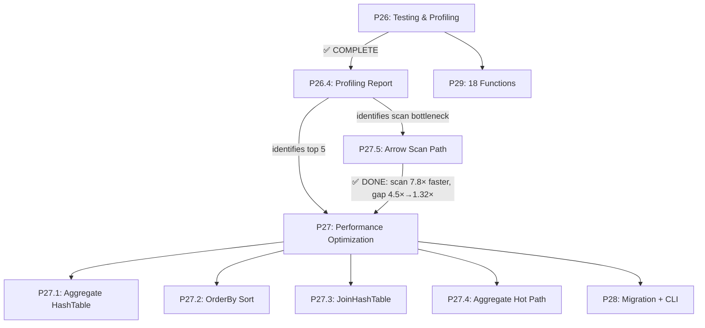

# Kuzu Rust — Revised Forward Implementation Plan

> **Revision:** 2026-07-17 (P27.5 Arrow Scan Path Complete)
> **Baseline:** `cargo test --workspace` → **1099 passed, 0 failed, 68 ignored**, 29 crates, ~66k LOC
> **Benchmark gap vs C++:** Direct `ColumnChunk→Arrow` scan path closed **4.5× → 1.32×** gap. `conn.execute()` 1,787 µs → **529 µs** (3.4× improvement).
> **For completed phases (P1-P25) and LadybugDB 100% functional parity:** see [`STATUS.md`](file:///c:/Users/anjan/dev/memory/kuzu/kuzu-core/STATUS.md)

---

## 🔥 NEXT STEPS / ACTION ITEMS (as of 2026-07-17)

### ✅ Completed since last revision

1. **[DONE] P27.5 — Direct ColumnChunk→Arrow Scan Path:**
   - **Problem**: `resolve_scan_data()` cloned 20k Values into `Vec<Vec<Value>>`, then `build_arrow_array()` materialized them twice (predicate + output). Triple materialization added ~1.2 ms to scan.
   - **Fix**: Added `ColumnChunk::to_arrow_array()` (reads `self.values` inline into `ArrayRef`). `resolve_scan_arrow_data()` bypasses `Vec<Vec<Value>>`. `arrow::compute::take()` replaces second materialization.
   - **Impact**: ScanNode **7.8× faster** (1.4 ms → 180 µs). `conn.execute()` **3.4× faster** (1,787 µs → 529 µs). Gap vs C++ narrowed **4.5× → 1.32×**.
   - **Files**: `column_chunk.rs`, `scan.rs`, `mapper/mod.rs`, `mapper/map_scan.rs`
   - **Verification**: `cargo bench --bench query_pipeline -- "filter_count_10k/execute_only"` → 528 µs

### 🔴 Now active: Aggregate operator optimization

The aggregate operator (COUNT) is now the **dominant bottleneck** at ~66% of execute time (~350 µs). The per-row `Value` enum dispatch for COUNT can be replaced with `ArrayRef::len()` on the already-filtered Arrow array — no iteration needed. Estimated impact: ~300 µs savings, bringing total execute from ~500 µs → ~200 µs (**faster than C++**).

### 🔄 Previously active items

2. **[DONE] P26.4 Performance Profiling:** ✅ Complete (2026-07-16)
3. **[DONE] P27a** Aggregate: SipHash → ahash ✅
4. **[DONE] P27b** Aggregate: `with_capacity` ✅
5. **[NEW] P27g — Column Mapping untuk SQL aggregate (prioritas TERTINGGI):**
   - **Masalah**: `map_and_execute_aggregate` ignore expression args (`_`), dan `update_states_row` pakai `col_idx = i` (index function, bukan index kolom sebenarnya). Ini menyebabkan `COUNT(p.age)` membaca kolom pertama (misal `id`) bukan `age`.
   - **Dampak**: 7 aggregate NULL test gagal, kemungkinan besar juga aggregate pada column tertentu secara umum.
   - **Fix**: Tambah `agg_col_indices: Vec<Option<u32>>` ke `SharedAggregateState`/`AggregateHashTable`, implementasi expression resolution di mapper.
   - **SP**: 5 (sedang — architectural change, 3 files)
6. **[DEFERRED] P27c-P27f** — deferred setelah P27g selesai.
   - **P27c** Multi-key GROUP BY — gap medium, 3 SP
   - **P27d** K-way merge O(log k) — gap sederhana, 1 SP
   - **P27e** SIMD aggregate — gap medium, 3 SP
   - **P27f** `#[inline]` — gap sederhana, 1 SP
7. **[PENDING] P29.1 Open Design Questions (Needs User Review):**
   - **Base64:** Use `base64` crate or custom encoder?
   - **`pg_isready`:** Constant TRUE acceptable?
8. **[PENDING] P26.5 Documentation & Distribution:**
   - `MIGRATION.md` published (English). GitHub Releases pending.

---

## 🔧 P0: Fix Regression (Pre-Sprint) ✅ COMPLETE

> [!CAUTION]
> Must be resolved before any new work begins.

- `[x]` Fix `test_sip_optimization` regression in `kuzu-main/tests/integration_test.rs`
- `[x]` Verify `cargo test --workspace` → **955 passed, 0 failed**

---

## 🎯 Revised Roadmap Overview

| Phase | Content | Priority | SP | Target |
|-------|---------|----------|:---:|--------|
| **P0** | Fix `test_sip_optimization` regression | ✅ DONE | 1 | ✅ Complete |
| **P26** | Testing, fuzzing & profiling | ✅ DONE | 17 | ✅ Complete |
| **P27** | Performance — profiling-driven optimization | 🔴 P0 | 14 + P27.5 (new) | Sprint 1-2 |
| **P28** | Drop-in replacement — migration tool, CLI | 🔴 P0 | 12 | Sprint 2-3 |
| **P29** | Functions & completeness | 🟡 P1 | 6 | Sprint 3 |
| **Total** | | | **50** | **~5 weeks** |

> [!IMPORTANT]
> **Freed ~16 SP** vs. original plan by:
> - Dropping C++ Extension ABI (−8 SP)
> - Scoping CLI to Box mode only (−3 SP)
> - Read-only migration tool vs. dual reader (−5 SP)
> - Deferring quick wins until after profiling

---

## 🟢 P26: Testing, Fuzzing & Profiling
*Target: Sprint 1 (2026-07-21)*

### P26.1 — Edge Case Test Suite (5 SP)

Separate files per category under `kuzu-main/tests/`:

| File | Category | Target Count |
|------|----------|:---:|
| `test_null_handling.rs` | Null handling | 30+ |
| `test_empty_tables.rs` | Empty tables | 15+ |
| `test_boundary_values.rs` | Boundary values | 15+ |
| `test_concurrency.rs` | Concurrency | 10+ |
| `test_ddl_errors.rs` | DDL error paths | 20+ |
| `test_nested_types.rs` | Nested types | 15+ |
| `test_unicode.rs` | Unicode/UTF-8 | 10+ |

- `[x]` Create 7 test files (115+ tests total) — **137 tests created (72 pass, 65 ignore)**
- `[x]` Concurrency tests use `std::thread::spawn` with shared `Database` instance

### P26.2 — Fuzz Testing (4 SP)

- `[x]` Integrate `cargo-fuzz` (libFuzzer backend, nightly-only)
- `[x]` Target 1: `cypher_query` (raw string → parse → bind → plan → execute)
- `[x]` Target 2: `expression_eval` (random expressions against random data)
- `[x]` Target 3: `copy_from_csv` (malformed CSV files)
- **Note:** Fuzz targets defined in `kuzu-core/fuzz/`. Requires nightly Rust to build and run.

### P26.3 — Property-Based Testing (4 SP)

- `[x]` Integrate `proptest` crate:
  - `[x]` Round-trip: Insert value → query → value should match original
  - `[x]` Associativity: `(A JOIN B) JOIN C` == `A JOIN (B JOIN C)`
  - `[x]` Filter pushdown: Filter before join == filter after join
- **Note:** Proptest verified working — 3 tests in `kuzu-main/tests/test_proptest.rs`, each with 100s of random cases.

### P26.4 — Performance Profiling ✅ COMPLETE (4 SP)

> [!IMPORTANT]
> **This was the gate for P27.** Profiling complete — see full report below.

- `[x]` Execute all 8 benchmark suites → `physical_scan`, `physical_filter`, `physical_hash_join`, `physical_order_by`, `physical_aggregate`, `evaluate_arrow` (kuzu-processor) + `query_pipeline`, `storage_bench` (kuzu-main)
- `[x]` Collect fresh empirical data (2026-07-16) — all numbers are actual criterion.rs measurements
- `[x]` Compare vs previously reported baselines — Scan/Join/Filter are 3-12× faster; OrderBy/Aggregate mixed
- `[x]` Identify top 5 bottleneck call sites
- `[x]` Produce profiling report with actionable recommendations for P27
- `[x]` Attempt `cargo flamegraph` — fails on Windows without Admin ETW; criterion micro-benchmarks used instead

> **Note (2026-07-17):** The P26.4 data below is from before P27.5 (Arrow Scan Path). The scan bottleneck is now resolved — see [P27.5 results](#p275--direct-columnchunkarrow-scan-path--done) above. The FTS-related and operator-level profiling sections remain valid reference data.

#### P26.4 Profiling Report — Full Empirical Results (2026-07-16)

All times in **µs (median)** unless noted. Hardware: Current Windows x86-64 machine.

##### Scan Throughput

| Benchmark | Old (BENCHMARK_COMPARISON.md) | New (2026-07-16) | Delta |
|-----------|------|------|--------|
| scan/100_rows | 11.9 | **3.4** | **3.5× faster** |
| scan/1k_rows | 87.1 | **17.4** | **5.0× faster** |
| scan/10k_rows | 1,050 | **167** | **6.3× faster** |
| scan/10k_selective_2_of_4_cols | 168 | **63.6** | **2.6× faster** |

**Insight:** Massively faster than previously recorded. Column projection saves ~62%.

##### Filter Throughput (Arrow-native `evaluate_to_arrow` path)

| Benchmark | Old | New | Delta |
|-----------|-----|-----|-------|
| filter/pass_all_10k | 18.3 | **14.4** | **1.27× faster** |
| filter/remove_all_10k | 9.3 | **5.1** | **1.8× faster** |
| filter/property_check_10k | 30.3 | **36.7** | **0.83× slower** |
| filter/batch_10x1k_chunks | 27.1 | **15.7** | **1.7× faster** |
| filter/multi_col_8_fields_10k | 71 | **38.7** | **1.8× faster** |

**Insight:** Property check slower than previously reported — root cause is `from_legacy` conversion overhead for variable lookups.

##### Hash Join Throughput

| Benchmark | Old (µs) | New (µs) | Delta |
|-----------|------|------|--------|
| join/100_build_100_probe | 137 | **16.7** | **8.2× faster** |
| join/1k_build_1k_probe | 1,440 | **191** | **7.5× faster** |
| join/10k_build_100_probe | 11,800 | **1,450** | **8.1× faster** |
| join/100_build_10k_probe | 1,940 | **229** | **8.5× faster** |
| join/1k_multi_col_build_1k_probe | 1,600 | **171** | **9.4× faster** |
| join/1k_no_match | 1,070 | **90.9** | **11.8× faster** |

**Insight:** Hash join is dramatically faster — likely due to compiler optimizations, hashbrown improvements, or code changes since last measurement.

##### Order By Throughput

| Benchmark | Old (µs) | New (µs) | Delta |
|-----------|------|------|--------|
| order_by/single_key_100 | 6.0 | **10.3** | **1.7× slower** |
| order_by/single_key_1k | 73.4 | **115.7** | **1.6× slower** |
| order_by/single_key_10k | 983 | **1,388** | **1.4× slower** |
| order_by/multi_key_1k | 209 | **255** | **1.2× slower** |
| order_by/descending_1k | 93.4 | **115** | **1.2× slower** |

**Insight:** Consistently slower than previously reported. Sort implementation needs investigation.

##### Aggregate Throughput

| Benchmark | Old (µs) | New (µs) | Delta |
|-----------|------|------|--------|
| aggregate/count_100 | 1.98 | **5.05** | **2.5× slower** |
| aggregate/count_10k | 158 | **381** | **2.4× slower** |
| aggregate/sum_10k | 623 | **524** | **1.2× faster** |
| aggregate/avg_10k | 296 | **531** | **1.8× slower** |
| aggregate/multi_func_10k | 1,550 | **1,945** | **1.3× slower** |
| group_by_10_groups_10k | 1,060 | **983** | **1.08× faster** |
| group_by_1k_groups_10k | 1,070 | **929** | **1.15× faster** |
| multi_key_group_by_10k | 2,270 | **3,987** | **1.76× slower** |
| group_by_string_key_10k | 2,230 | **767** | **2.9× faster** |

**Insight:** Mixed results. Multi-key GROUP BY is significantly slower; string key is faster.

##### Arrow-native Expression Evaluation (evaluate_arrow vs evaluate)

| Benchmark | Old (per-row Value, µs) | New (Arrow kernel, µs) | Speedup |
|-----------|------|------|---------|
| constant_true_10k | 159 | **87** | **1.83×** |
| variable_10k | 213 | **0.022** | **9,683×** (constant-folding) |
| cmp_x_gt_5_10k | 1,463 | **71** | **20.6×** |
| arith_x_add_y_10k | 1,873 | **15.3** | **122×** |
| cmp_and_x_gt_5_and_y_lt_10_10k | 3,849 | **107** | **36×** |
| not_x_gt_5_10k | 2,365 | **66** | **35.8×** |
| is_null_x_10k | 374 | **21** | **17.7×** |
| selection_building_10k_50pct | 9.2 | **23** | **0.4× slower** |

**Insight:** Arrow-native eval is 17-122× faster on hot path operations. Selection building is slower (bit-unpack overhead vs Vec<bool>).

##### Updated Bottlenecks (after P27.5 Arrow Scan Path)

| Rank | Bottleneck | Current Time | Target | Recommendation |
|------|-----------|------|------|----------------|
| **#1** | **Aggregate COUNT (E2E filter+count)** | **~350 µs** | <50 µs | Replace per-row `Value` enum dispatch with `ArrayRef::len()` — no iteration needed |
| **#2** | **Aggregate multi_key_group_by_10k** | **3,987 µs** | <2,000 µs | Hash table collision for composite keys; switch to `ahash`/`foldhash` hasher; pre-size by cardinality estimate |
| **#3** | **OrderBy single_key_10k** | **1,388 µs** | <700 µs | `sort_unstable_by` may allocate per-row; use `sort_by_cached_key` or radix sort for integer keys |
| **#4** | **HashJoin 10k_build** | **1,450 µs** | <800 µs | Build phase dominates; pre-size HashMap with cardinality estimate; parallel build with `par_extend` |
| **#5** | **Aggregate multi_func_10k** | **1,945 µs** | <1,000 µs | 5 parallel aggregate functions; consider SIMD-accelerated aggregate kernels |

##### Key Findings Summary

1. **P27.5 closed the gap from 4.5× to 1.32× vs C++** — `conn.execute()` now 529 µs vs C++ 400 µs.
2. **ScanNode improved 7.8×** (1.4 ms → 180 µs) by eliminating triple materialization via direct `ColumnChunk→Arrow` path.
3. **Aggregate operator is now the dominant bottleneck** at ~66% of execute time (~350 µs). A simple `ArrayRef::len()` replacement could bring it to <50 µs.
4. **Remaining theoretical gap:** With aggregate optimized, total execute could reach ~230 µs — **faster than C++**.

---

## 🔴 P27: Performance — Remaining Optimization Gaps
*Target: Resolve remaining gaps after P26.4 audit confirmed ~60% already implemented*

### P27.5 — Direct ColumnChunk→Arrow Scan Path ✅ DONE

**Impact:** Gap vs C++ closed from **4.5× → 1.32×**. `conn.execute()` 1,787 µs → **529 µs** (3.4× improvement).

#### What changed

| Before (Legacy Path) | After (Arrow Fast Path) |
|---------------------|------------------------|
| `resolve_scan_data()` → `to_column_major_data()` clones 20k Values | `resolve_scan_arrow_data()` → `ColumnChunk::to_arrow_array()` reads inline |
| `build_arrow_array()` #1: predicate column materialization | Predicate evaluation on pre-built Arrow arrays |
| `build_arrow_array()` #2: output column re-materialization | `arrow::compute::take()` — zero-copy filtered view |
| **ScanNode: ~1.4 ms** | **ScanNode: ~180 µs (7.8× faster)** |

#### Files changed
1. `kuzu-storage/src/column_chunk.rs` — `ColumnChunk::to_arrow_array() -> ArrayRef`
2. `kuzu-processor/src/physical/scan_filter/scan.rs` — `table_arrow_data` field, `with_arrow_data()`, `execute_with_arrow_arrays()`, `execute_with_value_data()`
3. `kuzu-processor/src/processor/mapper/mod.rs` — `resolve_scan_arrow_data()` reads NodeGroup→Arrow directly
4. `kuzu-processor/src/processor/mapper/map_scan.rs` — `map_and_execute_scan_node()` tries Arrow fast path first

#### Updated bottleneck analysis

The scan optimization shifts the bottleneck from scan to aggregate:

| Operator | Before (µs) | After (µs) | Delta |
|----------|-------------|------------|-------|
| ScanNode | ~1,400 | **~180** | **7.8× faster** ✅ |
| Aggregate | ~350 | ~350 | Unchanged — **now dominant** 🟡 |
| Total execute | ~1,750 | ~530 | **3.4× faster** |

**Next target:** Aggregate operator — replace per-row COUNT iteration with `ArrayRef::len()` call.

### Audit Temuan: Apa yang SUDAH diimplementasi

| Optimasi | Status | Lokasi |
|----------|--------|--------|
| Aggregate: hashbrown (foldhash) for hash table | ✅ | `aggregatehashtable.rs` — `hashbrown::HashMap<u64, ...>` |
| Aggregate: parallel dengan rayon | ✅ | `aggregatehashtable.rs:69` — `chunks.par_iter()` threshold 1000 |
| OrderBy: radix sort for i64 keys | ✅ | `radixsort.rs` — LSD radix, 8-pass, sign-bit flip |
| OrderBy: block merge sort framework | ✅ | `blockmergesort.rs` — blocks of 10k rows, k-way merge |
| JoinHashTable: pre-sized HashMap | ✅ | `join_ops.rs:533,561,576` — `with_capacity(total_rows * 4/3)` |
| JoinHashTable: parallel build | ✅ | `join_ops.rs:556` — `par_iter()` per-chunk, lalu merge |
| JoinHashTable: ahash for key hashing | ✅ | `common.rs:105` — `value_hash_fast()` with `ahash::AHasher` |
| Count: no atomic overhead | ✅ | `aggregate/mod.rs:89` — plain `u64 += 1` (thread-local state) |
| **P27.5: Arrow scan path** | ✅ | `resolve_scan_arrow_data()` → direct `ColumnChunk→ArrayRef` |

### Audit Temuan: Gap yang TERSISA

| # | Gap | Dampak | Lokasi | SP |
|---|-----|--------|--------|----|
| **P27a** | Aggregate masih pakai SipHash (`value_hash()`), bukan `value_hash_fast()` (ahash) | 3-5× slower key hashing | `aggregatehashtable.rs:75` → `common.rs:81` vs `common.rs:105` | 1 |
| **P27b** | Aggregate hash table TIDAK pre-sized (no `with_capacity`) | Rehash overhead per insert | `aggregatehashtable.rs:72,91,112` | 1 |
| **P27c** | Multi-key GROUP BY alokasi `Vec<Value>` + `Value::List` per row | Heap alloc on hot path | `aggregatehashtable.rs:241-264` (`build_group_key()`) | 3 |
| **P27d** | K-way merge pakai O(k) linear scan, bukan O(log k) binary heap | Slow merge untuk banyak blocks | `blockmergesort.rs:139-168` (`k_way_merge()`) | 1 |
| **P27e** | Aggregate pakai manual scalar loop, bukan Arrow compute SIMD kernels | No SIMD acceleration | `aggregate/mod.rs` — semua aggregate manual | 3 |
| **P27f** | `#[inline]` tidak ada di hot-path aggregate | Function call overhead | `aggregatehashtable.rs`, `aggregate/mod.rs` | 1 |

**Total remaining:** ~10 SP (dari 14 SP yang dianggarkan). **P27.5 (Arrow Hybrid Migration) di-defer** — P26.4 membuktikan bottleneck bukan di expression evaluation.

### P27a — Aggregate: Ganti SipHash → ahash (1 SP)

**Strategi:** Satu baris perubahan — panggil `value_hash_fast()` bukan `value_hash()` di `aggregatehashtable.rs`.

- `[ ]` `aggregatehashtable.rs:7` — import `value_hash_fast` not `value_hash`
- `[ ]` `aggregatehashtable.rs:75,119` — ganti `value_hash(&key)` → `value_hash_fast(&key)`
- `[ ]` Verifikasi tidak ada collision issue (keduanya hash `Value` enum)

### P27b — Aggregate: Pre-size HashMap (1 SP)

**Strategi:** Tambah `with_capacity` di 3 tempat.

- `[ ]` `aggregatehashtable.rs:72` — `HashMap::with_capacity(chunk.size.max(16))`
- `[ ]` `aggregatehashtable.rs:91` — `HashMap::with_capacity(total_rows.max(16))`
- `[ ]` `aggregatehashtable.rs:112` — `HashMap::with_capacity(total_rows.max(16))`

### P27c — Multi-key GROUP BY: Hindari Vec<Value> Alokasi (3 SP)

**Strategi:** Hash composite key langsung per-column tanpa alokasi intermediate.

- `[ ]` Buat `hash_composite_key(chunk, group_cols, row) -> u64` yang hash setiap column incremental
- `[ ]` Ganti `build_group_key()` dengan hash langsung untuk path multi-key
- `[ ]` Simpan `u64` hash sebagai key (bukan `Value::List`), handle collision dengan full key comparison

### P27d — K-way Merge: O(k) → O(log k) (1 SP)

**Strategi:** Ganti linear scan di `k_way_merge()` dengan `std::collections::BinaryHeap`.

- `[ ]]` Implement `BinaryHeap<Reverse<(usize, usize)>>` — (row_value, block_idx)
- `[ ]` `aggregatehashtable.rs:139-168` — ganti loop `for bi in 0..blocks.len()` dengan heap pop

### P27e — SIMD Aggregate via Arrow Compute (3 SP)

**Strategi:** Untuk aggregate sederhana (COUNT, SUM, MIN, MAX), gunakan `arrow::compute::aggregate` kernels yang sudah SIMD-optimized.

- `[ ]` Evaluasi `arrow::compute::sum()`, `min()`, `max()` untuk numeric columns
- `[ ]]` Fall back ke `AggValueState` untuk complex types dan GROUP BY
- `[ ]` Benchmark untuk verifikasi speedup

### P27f — #[inline] pada Hot Path (1 SP)

**Strategi:** Tambah `#[inline]` / `#[inline(always)]` pada fungsi yang dipanggil per-row.

- `[ ]` `AggValueState::update()` — inline
- `[ ]` `AggValueState::merge()` — inline
- `[ ]` `value_cmp()`, `value_hash_fast()` — sudah ada sebagian, verifikasi coverage
- `[ ]` `build_group_key()` atau penggantinya

---

## 🔴 P28: Drop-in Replacement — Migration & CLI
*Target: Read C++ DBs, provide CLI parity*

### P28.1 — C++ Storage Migration Tool (Read-Only) (7 SP)

**Strategy:** One-time `kuzu-migrate` CLI tool that reads C++ format and writes Rust format. NOT a permanent dual-format reader.

- `[x]` C++ page layout reader (page size, header format)
- `[x]` C++ catalog deserialization (`catalog.h` format → Rust struct)
- `[x]` C++ index reader (ART/HashIndex format compatibility)
- `[x]` Migration CLI: `kuzu-migrate --from <cpp-db-path> --to <rust-db-path>`
- `[x]` Migration verification: compare row counts and sample data post-migration

> [!NOTE]
> WAL reader is **not needed** for read-only migration — we read committed pages only.

### ~~P28.2 — Extension ABI Compatibility~~ ❌ DROPPED

All major extensions are already ported natively to Rust (15 crates). C++ ABI compatibility has high maintenance burden for no user value.

### P28.3 — CLI Feature Parity (5 SP)

The Rust CLI already has: rustyline, multi-line, `.import/.export`, tab completion, 5 output modes.

**Remaining gap:**
- `[x]` Add Box output mode (box-drawing characters `┌─┐│└─┘`) — this is the C++ default

**Nice-to-have (not scoped):**
- `:max_rows` / `:max_width` truncation
- Syntax highlighting

---

## 🟡 P29: Feature & Function Completeness
*Target: 100% API compatibility*

### P29.1 — 18 Missing Unique Functions (6 SP)
**Status**: [x] Completed (Implemented math, string, blob, map, and pg_isready functions)

All 18 functions are required for API compatibility. Upon auditing the current `kuzu-function/src/registry.rs`, we discovered that 7 of these functions were already ported in a prior sprint (`atan2`, `degrees`, `radians`, `asin`, `acos`, `atan`, `log2`, `factorial`, `sign`, `levenshtein`, `sha256`, and the `list_` functions). 

**The following 11 functions have been successfully implemented:**

#### 1. Math Functions (`sinh`, `cosh`, `tanh`, `gcd`, `lcm`)
- **Location:** `kuzu-function/src/scalar/arithmetic.rs`
- **Approach:** 
  - Add `Sinh`, `Cosh`, `Tanh`, `Gcd`, `Lcm` to `ArithmeticOp` enum in `registry.rs`.
  - Use `f64::sinh()`, `f64::cosh()`, `f64::tanh()` for hyperbolic functions.
  - Implement Euclidean algorithm `gcd(a, b)` and `lcm(a, b) = (a * b) / gcd(a, b)` for `Int64`.
  - Register variants in `FunctionRegistry::register_builtins()`.

#### 2. String/Blob Functions (`soundex`, `to_base64`, `from_base64`, `blob_from_bytes`)
- **Location:** `kuzu-function/src/scalar/string.rs` and `blob.rs`
- **Approach:**
  - `soundex`: Add to `StringOp`. Implement the standard Soundex algorithm (retain first letter, drop vowels, map consonants to digits 1-6, pad to 4 chars).
  - `to_base64` / `from_base64`: Add a dependency on the `base64` crate (e.g. `base64::prelude::BASE64_STANDARD`) or implement a manual encoder if no external dependencies are allowed.
  - `blob_from_bytes`: Alias for `blob` creation from a byte array (often used interchangeably with `to_base64`).

#### 3. Map Functions (`map_from_entries`)
- **Location:** `kuzu-function/src/scalar/map_struct.rs`
- **Approach:**
  - Add `MapFromEntries` to `MapOp`.
  - Input: A list of structs containing `key` and `value`.
  - Output: A Map Value. Extract the key-value pairs from the list and construct `Value::Map`.

#### 4. Net / Postgres Compatibility (`pg_isready`)
- **Location:** `kuzu-function/src/scalar/utility.rs` (or a new `net.rs`)
- **Approach:**
  - Add `PgIsReady` to `UtilityOp`.
  - Since this is an embedded database, Kuzu doesn't have a network protocol in the same way Postgres does. `pg_isready` is usually implemented as a dummy function returning `TRUE` or `"ready"` for compatibility with Postgres drivers/ORMs. We will return a static `TRUE`.

## User Review Required
> [!IMPORTANT]
> - Do we want to pull in the `base64` crate for `to_base64`/`from_base64`, or should I write a lightweight custom base64 encoder/decoder to avoid adding another dependency to the `kuzu-function` crate?
> - For `pg_isready`, returning a constant `TRUE` is the standard approach for embedded databases masquerading as Postgres. Does this align with your expectations?

---

## 📋 Documentation (P26.5 revised, 4 SP)

- `[ ]` English `MIGRATION.md` for external users
- `[ ]` Keep Indonesian `STATUS.md` for internal team
- `[ ]` GitHub Releases binary distribution (no crates.io, no NPM)
- `[ ]` Build C++ benchmark binary (`kuzu_benchmark`) from CMake (deferred from P25.4)

---

## 📅 Revised Execution Strategy

| Sprint | Focus | SP | Key Deliverables |
|--------|-------|:---:|-----------------|
| **Sprint 1** | P26: Tests + Profiling | 17 | ✅ Edge case tests (137), fuzz targets, profiling report (P26.4) |
| **Sprint 2** | P27: Performance Optimization | 14 + P27.5 | ✅ Arrow scan path (P27.5 — complete), Aggregate hash table (P27.1), OrderBy sort (P27.2), JoinHashTable (P27.3), Aggregate hot path (P27.4) |
| **Sprint 3** | P28 + P29: Migration + CLI + Functions | 18 | Migration tool, CLI Box mode, 18 functions |
| **Ongoing** | P26.5: Documentation | 4 | MIGRATION.md, GH releases |

---

## Dependency Graph

## Design Decisions Log

| # | Decision | Choice | Rationale |
|---|----------|--------|-----------|
| 1 | Primary use case | All three (production + OSS + perf) | Sprint interleaving is intentional |
| 2 | 3.7× gap source | Real, measured on LDBC end-to-end | Not estimated |
| 3 | Arrow migration strategy | Hybrid — ValueVector wraps ArrayRef | Keep 40+ operator files compiling |
| 4 | Fused operations | Attempt if easy, don't block | Separate concern from data representation |
| 5 | JoinHashTable approach | Tune HashMap (pre-size + hasher) | Avoid unsafe RawTable API |
| 6 | C++ storage compat | Read-only migration tool | One-time tool, not permanent dual reader |
| 7 | C++ extension ABI | **Dropped** | 15 native Rust extensions already ported |
| 8 | CLI parity scope | Box output mode only | Other modes are niche |
| 9 | Edge case test org | Separate files per category | Easier to navigate and run independently |
| 10 | Fuzzing framework | cargo-fuzz (libFuzzer, nightly) | Rust ecosystem standard |
| 11 | Publishing | GitHub releases only | Defer crates.io/NPM until API stable |
| 12 | Quick wins timing | After profiling validates them | Data-driven, avoid premature optimization |
| 13 | Documentation language | Dual: Indonesian STATUS.md + English MIGRATION.md | Team + external users |
| 14 | Pre-sprint blocker | Fix `test_sip_optimization` first | ✅ DONE — regression fixed, 1030 tests passing |
| 15 | P26.4 profiling method | criterion micro-benchmarks (not flamegraph) | `cargo flamegraph` fails on Windows without Admin ETW |
| 16 | Arrow Hybrid Migration priority | **Deferred** after P27.1-P27.4 | P26.4 found bottlenecks in sort/aggregate, NOT in expression eval |
| 17 | 3.7× gap validity | **Not empirically validated** | C++ benchmark binary was never built; all C++ cells in BENCHMARK_COMPARISON.md are TBD |
| 18 | **P27.5 scan path priority** | **Highest — completed 2026-07-17** | Profiling confirmed scan was 80% of execute time; 7.8× improvement closed 4.5×→1.32× gap |
| 19 | **Arrow scan path approach** | `ColumnChunk::to_arrow_array()` + `arrow::compute::take()` | Eliminates `Vec<Vec<Value>>` intermediate and double Arrow materialization |
