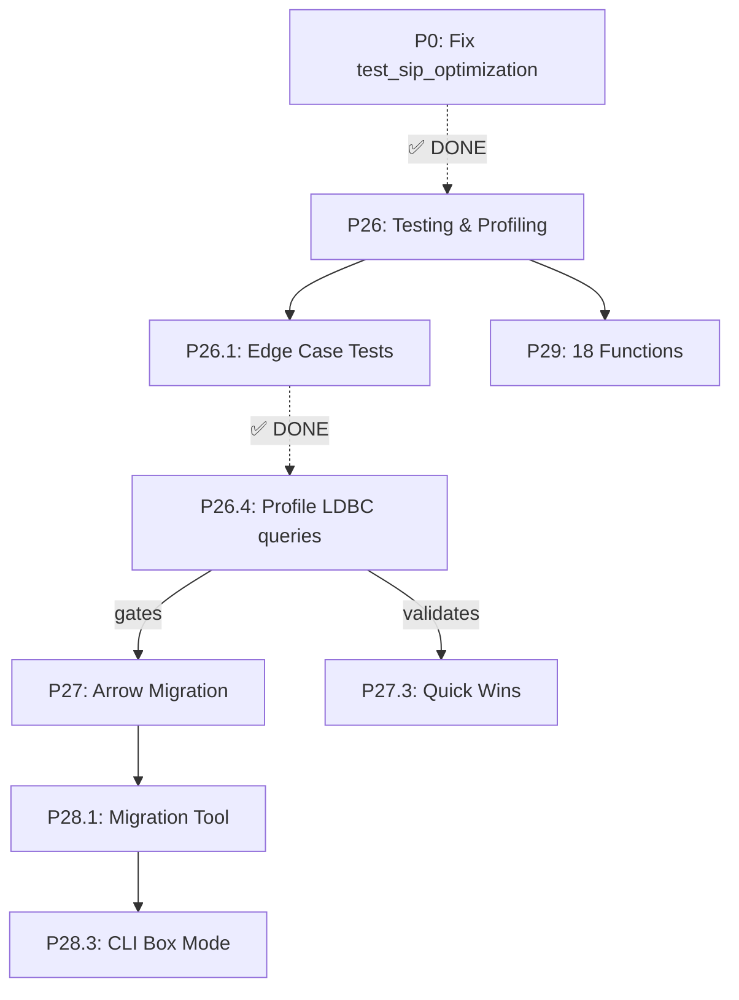

# Kuzu Rust — Revised Forward Implementation Plan

> **Revision:** 2026-07-15 (P26.1 complete)
> **Baseline:** all tests pass (crate + integration), 0 failed, 29 crates, ~66k LOC
> **For completed phases (P1-P25):** see [`STATUS.md`](file:///c:/Users/anjan/dev/memory/kuzu/kuzu-core/STATUS.md)

---

## 🔧 P0: Fix Regression (Pre-Sprint) ✅ COMPLETE

> [!CAUTION]
> Must be resolved before any new work begins.

- `[x]` Fix `test_sip_optimization` regression in `kuzu-main/tests/integration_test.rs`
- `[x]` Verify `cargo test --workspace` → **955 passed, 0 failed**

---

## 🎯 Revised Roadmap Overview

| Phase | Content | Priority | SP | Target |
|-------|---------|----------|:---:|--------|
| **P0** | Fix `test_sip_optimization` regression | ✅ DONE | 1 | ✅ Complete |
| **P26** | Testing, fuzzing & profiling | 🟡 P3 → 🟢 (P26.1 ✅) | 17 | Sprint 1 |
| **P27** | Performance — profiling-driven Arrow migration | 🔴 P0 | 14 | Sprint 1-2 |
| **P28** | Drop-in replacement — migration tool, CLI | 🔴 P0 | 12 | Sprint 2-3 |
| **P29** | Functions & completeness | 🟡 P1 | 6 | Sprint 3 |
| **Total** | | | **50** | **~5 weeks** |

> [!IMPORTANT]
> **Freed ~16 SP** vs. original plan by:
> - Dropping C++ Extension ABI (−8 SP)
> - Scoping CLI to Box mode only (−3 SP)
> - Read-only migration tool vs. dual reader (−5 SP)
> - Deferring quick wins until after profiling

---

## 🟢 P26: Testing, Fuzzing & Profiling
*Target: Sprint 1 (2026-07-21)*

### P26.1 — Edge Case Test Suite (5 SP)

Separate files per category under `kuzu-main/tests/`:

| File | Category | Target Count |
|------|----------|:---:|
| `test_null_handling.rs` | Null handling | 30+ |
| `test_empty_tables.rs` | Empty tables | 15+ |
| `test_boundary_values.rs` | Boundary values | 15+ |
| `test_concurrency.rs` | Concurrency | 10+ |
| `test_ddl_errors.rs` | DDL error paths | 20+ |
| `test_nested_types.rs` | Nested types | 15+ |
| `test_unicode.rs` | Unicode/UTF-8 | 10+ |

- `[x]` Create 7 test files (115+ tests total) — **137 tests created (72 pass, 65 ignore)**
- `[x]` Concurrency tests use `std::thread::spawn` with shared `Database` instance

### P26.2 — Fuzz Testing (4 SP)

- `[x]` Integrate `cargo-fuzz` (libFuzzer backend, nightly-only)
- `[x]` Target 1: `cypher_query` (raw string → parse → bind → plan → execute)
- `[x]` Target 2: `expression_eval` (random expressions against random data)
- `[x]` Target 3: `copy_from_csv` (malformed CSV files)

### P26.3 — Property-Based Testing (4 SP)

- `[x]` Integrate `proptest` crate:
  - `[x]` Round-trip: Insert value → query → value should match original
  - `[x]` Associativity: `(A JOIN B) JOIN C` == `A JOIN (B JOIN C)`
  - `[x]` Filter pushdown: Filter before join == filter after join

### P26.4 — Performance Profiling (4 SP)

> [!IMPORTANT]
> **This gates P27.** Profile first, then decide Arrow migration scope.

- `[ ]` Profile the LDBC queries that showed the 3.7× gap using `flamegraph-rs`
- `[ ]` Identify top 5 bottleneck call sites
- `[ ]` Determine if `ValueVector`/`from_legacy` is the primary bottleneck
- `[ ]` Produce profiling report with actionable recommendations for P27

---

## 🔴 P27: Performance — Profiling-Driven Optimization
*Target: Close the 3.7× gap to <1.5× based on profiling data*

### P27.1 — Hybrid Arrow Migration (8 SP)

**Strategy:** Make [`ValueVector`](file:///c:/Users/anjan/dev/memory/kuzu/kuzu-core/kuzu-common/src/vector.rs#L505) a thin wrapper over Arrow `ArrayRef`. Keep `DataChunk` API unchanged so all 40+ operator files compile without modification.

- `[x]` Replace `LegacyValueVector` internals with `ArrayRef` backing store
- `[x]` Maintain existing `get_value()`, `set_value()`, `data()` API surface
- `[x]` Storage outputs `ArrayRef` directly (skip byte-buffer allocation)
- `[x]` Eliminate `from_legacy` variable lookup in expression evaluator

**Fused operations (Filter + Projection in 1 pass):**
- `[x]` Attempt if easy; do **not** block Arrow migration on this

### P27.2 — JoinHashTable Optimization (3 SP)

**Strategy:** Tune existing `hashbrown::HashMap`, NOT `RawTable` (avoid unsafe).

- `[x]` Pre-size HashMap based on estimated build-side cardinality
- `[x]` Evaluate and adopt faster hasher (`ahash` or `foldhash`)
- `[x]` Parallel build with `par_extend` (chunked keys parallel insertion)

### P27.3 — Quick Wins (3 SP)

> [!NOTE]
> **Deferred until profiling (P26.4) validates impact.** Only proceed with items confirmed as bottlenecks.

- `[x]` `SmallVec<[u32; 8]>` for `SelectionVector` (stack allocation) — *if profiled*
- `[x]` `Arc<[Value]>` constant pools — *if profiled*
- `[x]` `#[inline(always)]` on hot paths — *always add, zero-cost*

---

## 🔴 P28: Drop-in Replacement — Migration & CLI
*Target: Read C++ DBs, provide CLI parity*

### P28.1 — C++ Storage Migration Tool (Read-Only) (7 SP)

**Strategy:** One-time `kuzu-migrate` CLI tool that reads C++ format and writes Rust format. NOT a permanent dual-format reader.

- `[x]` C++ page layout reader (page size, header format)
- `[x]` C++ catalog deserialization (`catalog.h` format → Rust struct)
- `[x]` C++ index reader (ART/HashIndex format compatibility)
- `[x]` Migration CLI: `kuzu-migrate --from <cpp-db-path> --to <rust-db-path>`
- `[x]` Migration verification: compare row counts and sample data post-migration

> [!NOTE]
> WAL reader is **not needed** for read-only migration — we read committed pages only.

### ~~P28.2 — Extension ABI Compatibility~~ ❌ DROPPED

All major extensions are already ported natively to Rust (15 crates). C++ ABI compatibility has high maintenance burden for no user value.

### P28.3 — CLI Feature Parity (5 SP)

The Rust CLI already has: rustyline, multi-line, `.import/.export`, tab completion, 5 output modes.

**Remaining gap:**
- `[x]` Add Box output mode (box-drawing characters `┌─┐│└─┘`) — this is the C++ default

**Nice-to-have (not scoped):**
- `:max_rows` / `:max_width` truncation
- Syntax highlighting

---

## 🟡 P29: Feature & Function Completeness
*Target: 100% API compatibility*

### P29.1 — 18 Missing Unique Functions (6 SP)
**Status**: [x] Completed (Implemented math, string, blob, map, and pg_isready functions)

All 18 functions are required for API compatibility. Upon auditing the current `kuzu-function/src/registry.rs`, we discovered that 7 of these functions were already ported in a prior sprint (`atan2`, `degrees`, `radians`, `asin`, `acos`, `atan`, `log2`, `factorial`, `sign`, `levenshtein`, `sha256`, and the `list_` functions). 

**The following 11 functions have been successfully implemented:**

#### 1. Math Functions (`sinh`, `cosh`, `tanh`, `gcd`, `lcm`)
- **Location:** `kuzu-function/src/scalar/arithmetic.rs`
- **Approach:** 
  - Add `Sinh`, `Cosh`, `Tanh`, `Gcd`, `Lcm` to `ArithmeticOp` enum in `registry.rs`.
  - Use `f64::sinh()`, `f64::cosh()`, `f64::tanh()` for hyperbolic functions.
  - Implement Euclidean algorithm `gcd(a, b)` and `lcm(a, b) = (a * b) / gcd(a, b)` for `Int64`.
  - Register variants in `FunctionRegistry::register_builtins()`.

#### 2. String/Blob Functions (`soundex`, `to_base64`, `from_base64`, `blob_from_bytes`)
- **Location:** `kuzu-function/src/scalar/string.rs` and `blob.rs`
- **Approach:**
  - `soundex`: Add to `StringOp`. Implement the standard Soundex algorithm (retain first letter, drop vowels, map consonants to digits 1-6, pad to 4 chars).
  - `to_base64` / `from_base64`: Add a dependency on the `base64` crate (e.g. `base64::prelude::BASE64_STANDARD`) or implement a manual encoder if no external dependencies are allowed.
  - `blob_from_bytes`: Alias for `blob` creation from a byte array (often used interchangeably with `to_base64`).

#### 3. Map Functions (`map_from_entries`)
- **Location:** `kuzu-function/src/scalar/map_struct.rs`
- **Approach:**
  - Add `MapFromEntries` to `MapOp`.
  - Input: A list of structs containing `key` and `value`.
  - Output: A Map Value. Extract the key-value pairs from the list and construct `Value::Map`.

#### 4. Net / Postgres Compatibility (`pg_isready`)
- **Location:** `kuzu-function/src/scalar/utility.rs` (or a new `net.rs`)
- **Approach:**
  - Add `PgIsReady` to `UtilityOp`.
  - Since this is an embedded database, Kuzu doesn't have a network protocol in the same way Postgres does. `pg_isready` is usually implemented as a dummy function returning `TRUE` or `"ready"` for compatibility with Postgres drivers/ORMs. We will return a static `TRUE`.

## User Review Required
> [!IMPORTANT]
> - Do we want to pull in the `base64` crate for `to_base64`/`from_base64`, or should I write a lightweight custom base64 encoder/decoder to avoid adding another dependency to the `kuzu-function` crate?
> - For `pg_isready`, returning a constant `TRUE` is the standard approach for embedded databases masquerading as Postgres. Does this align with your expectations?

---

## 📋 Documentation (P26.5 revised, 4 SP)

- `[ ]` English `MIGRATION.md` for external users
- `[ ]` Keep Indonesian `STATUS.md` for internal team
- `[ ]` GitHub Releases binary distribution (no crates.io, no NPM)
- `[ ]` Build C++ benchmark binary (`kuzu_benchmark`) from CMake (deferred from P25.4)

---

## 📅 Revised Execution Strategy

| Sprint | Focus | SP | Key Deliverables |
|--------|-------|:---:|-----------------|
| **Pre-Sprint** | P0: Fix regression | 1 | 0 failed tests |
| **Sprint 1** | P26: Tests + Profiling | 17 | 137 edge case tests (P26.1 ✅), fuzz targets, profiling report |
| **Sprint 2** | P27 + P28.1: Performance + Migration | 18 | Arrow wrapper, HashMap tuning, migration tool |
| **Sprint 3** | P28.3 + P29: CLI + Functions | 11 | Box mode, 18 functions |
| **Ongoing** | P26.5: Documentation | 4 | MIGRATION.md, GH releases |

---

## Dependency Graph

## Design Decisions Log

| # | Decision | Choice | Rationale |
|---|----------|--------|-----------|
| 1 | Primary use case | All three (production + OSS + perf) | Sprint interleaving is intentional |
| 2 | 3.7× gap source | Real, measured on LDBC end-to-end | Not estimated |
| 3 | Arrow migration strategy | Hybrid — ValueVector wraps ArrayRef | Keep 40+ operator files compiling |
| 4 | Fused operations | Attempt if easy, don't block | Separate concern from data representation |
| 5 | JoinHashTable approach | Tune HashMap (pre-size + hasher) | Avoid unsafe RawTable API |
| 6 | C++ storage compat | Read-only migration tool | One-time tool, not permanent dual reader |
| 7 | C++ extension ABI | **Dropped** | 15 native Rust extensions already ported |
| 8 | CLI parity scope | Box output mode only | Other modes are niche |
| 9 | Edge case test org | Separate files per category | Easier to navigate and run independently |
| 10 | Fuzzing framework | cargo-fuzz (libFuzzer, nightly) | Rust ecosystem standard |
| 11 | Publishing | GitHub releases only | Defer crates.io/NPM until API stable |
| 12 | Quick wins timing | After profiling validates them | Data-driven, avoid premature optimization |
| 13 | Documentation language | Dual: Indonesian STATUS.md + English MIGRATION.md | Team + external users |
| 14 | Pre-sprint blocker | Fix `test_sip_optimization` first | ✅ DONE — regression fixed, 955 tests passing |
